# Coding Kanban

<p align="center">
  <strong>面向 CLI Coding Agent 的本地 / 内网多会话工作台</strong><br />
  把看板、真实终端、tmux、SSH、结构化会话记录、Git Diff、文件浏览器、VS Code Web 和手机接管整合为一个连续工作流。
</p>

<p align="center">
  <a href="#快速开始">快速开始</a> ·
  <a href="#新用户安装检查清单">安装检查</a> ·
  <a href="#更新日志">更新日志</a> ·
  <a href="#产品视图与功能导览">截图导览</a> ·
  <a href="#完整功能说明">完整功能</a> ·
  <a href="#典型工作流">工作流</a> ·
  <a href="#部署安全与边界">安全边界</a>
</p>

> [!WARNING]
> Coding Kanban 的后端可以执行终端、SSH、tmux、Git 只读查询和文件系统操作。它面向可信本机或内网环境，**不要直接暴露到公网**。

## 为什么需要 Coding Kanban

同时运行多个 Copilot、Codex、Claude 或 shell 会话时，真正困难的通常不是“再打开一个终端”，而是：

- 哪个 Agent 正在执行，哪个在等待确认，哪个已经完成但还没验收？
- 如何从几十个 tmux pane 中快速找到目标，并继续输入而不丢上下文？
- 如何在终端旁边查看任务摘要、Git 变化、文件和完整会话记录？
- 如何让桌面和手机使用同一套会话，不在移动端重新建立一套工作流？
- 如何控制大量终端 WebSocket、xterm 和 VS Code iframe 带来的浏览器资源开销？

Coding Kanban 将这些问题收敛为一条主流程：

```text
扫描 / 新建会话
      ↓
四列注意力看板
      ↓
聚焦一个终端或同时监控多个终端
      ↓
查看结构化记录、Git Changes、文件或 VS Code
      ↓
桌面继续工作，或在手机端接管
```

## 核心能力一览

| 能力 | 当前行为 |
| --- | --- |
| 注意力看板 | 自动分为“需响应 / 执行中 / 待验收 / 可继续”，列头显示数量 |
| 卡片上下文 | 展示最后用户任务、最后 Agent 回复、项目、分支/worktree、文件数及增删行 |
| 已读管理 | 完成态可主动标记已读/未读，状态由服务端持久化 |
| 排序与分组 | 按最近活动、项目、名称排序；用户分组在四列内独立折叠 |
| 真实终端 | xterm.js + WebSocket，支持 replay、resize、stdin、控制键和 OSC 52 |
| 多屏监控 | 1/2/3/4/6/8 屏；多个终端同时观察，但只有一个输入窗格 |
| tmux | 本地/SSH 扫描、创建、attach、接管、释放、刷新、终止 |
| Agent 扫描 | 扫描本地或 SSH 工作目录，识别结构化 Agent 会话并与 tmux 合并 |
| 完整记录 | 本机 Codex JSONL 结构化记录，隐藏 exec 噪声，Markdown/GFM/KaTeX 渲染 |
| 变更审查 | “本次任务”与“当前工作区”双 Diff，文件筛选、全屏查看、复制和引用 |
| 文件浏览器 | 本地/SSH 浏览、预览、编辑、上传、下载、拖拽、chmod、Markdown/LaTeX |
| VS Code Web | 本地与 SSH 远端 code-server，通过 `/vscode/` 内嵌并限制 iframe 缓存 |
| 手机工作区 | 注意力看板、活动、项目/文件、终端快捷键、完整记录和手机 Diff |
| 飞书通知与续跑 | 所有已登记看板任务结束后可通过本地 `lark-cli` 机器人发送 Card 2.0 私聊/群聊完成卡片；私聊用户还可回复某张卡片，把文字安全送回对应的在线 Codex 终端 |
| 更新与恢复 | 用户确认后 fast-forward 更新；重启后恢复 managed tmux 和布局 |
| 资源诊断 | xterm、WebSocket、快照吞吐、终端流、VS Code iframe、long task、heap |

## 更新日志

> [!IMPORTANT]
> **2026-09-01 · 飞书通知支持直接回复并继续对应 Codex**
>
> Kanban 后端会观察已登记会话的真正完成点，再由本机 `lark-cli` 机器人向指定用户或群聊发送 Card 2.0 完成卡片。按钮开启前已经运行的 Codex 以及之后启动的其他 Agent 会话都能覆盖，不依赖页面保持打开；Codex 通知优先携带对话最后一条完整回复，长正文自动分成多张卡片。使用私聊目标时，还可单独开启“飞书回复继续执行”，回复某张卡片即可把文字送回它绑定的在线 Codex 终端。个人接收者 ID、登录态、回复绑定和凭证继续只保存在本机。配置与边界见 [Kanban 任务完成飞书通知与回复续跑](docs/codex-feishu-notifications.md)。

### 重要里程碑

| 时间 | 更新内容 |
| --- | --- |
| 2026-09 | 接入 Codex ↔ 飞书双向工作流：完成提醒、完整回复分片，以及从私聊回复继续对应会话 |
| 2026-08 | 新增结构化会话摘要、完整记录、双 Diff Review、Markdown 阅读和手机工作区 |
| 2026-07 | 加入用户分组、应用热更新、managed tmux 会话恢复及监控窗格联动 |
| 2026-06 | 上线手机终端、浏览器资源诊断、完成通知、常驻开发服务和多终端布局 |
| 2026-05 | 文件上传新增相对路径支持和上传状态反馈 |
| 2026-04 | 上线文件浏览器、VS Code Web、SSH 远端文件与远端 VS Code 工作流 |
| 2026-03 | 建立四列看板、真实终端、tmux 会话管理、快速连接和局域网访问基础 |

### 功能更新时间线（新 → 旧）

> 这里只记录新增能力和已有工作流的功能扩展，不收录 Bug 修复、测试、文档、重构或合并提交。链接为该功能的代表性提交，并非完整提交清单。

#### 2026 年 9 月

- `2026-09-01` — 飞书任务完成提醒升级为紧凑的 Card 2.0 卡片，以完成态颜色分开展示项目、会话和可折叠的完整最后输出；长回复按序拆成多张卡片，回复任意一张仍能继续原 Codex 会话。
- `2026-09-01` — 飞书私聊通知支持直接回复继续对应的在线 Codex，会话绑定、发送者校验、事件去重和输入限制全部保留在 Kanban 本地；完成通知与回复控制使用两个独立开关。
- `2026-09-01` — “新建会话”增加手动 SSH 连接，可直接填写主机、端口、用户名和本机私钥路径；Codex 飞书提醒改为发送最后一条完整回复，长正文按序分片而不截断。
- `2026-09-01` — 顶栏把“工具”和“资源调节”合并进统一设置面板；飞书通知开关由后端统一覆盖按钮开启前已经运行和之后启动的所有看板任务。
- `2026-09-01` [`6e00f4f`](https://github.com/xzktx003/coding_kanban/commit/6e00f4f5513fe990ea8c244c918ed0be0242a85b) — 接入 Codex 原生完成事件到飞书机器人通知，支持仓库作用域、隐私裁剪、重试和幂等发送。

#### 2026 年 8 月

- `2026-08-31` [`1e94262`](https://github.com/xzktx003/coding_kanban/commit/1e94262b0800bd125c002f6e6d2bf3a4c5da6d00) — 在活动终端旁直接查看 Codex 历史记录。
- `2026-08-28` [`dad52a3`](https://github.com/xzktx003/coding_kanban/commit/dad52a3138245fe104037b48b531ac7ca24f73df) — 支持把图片等视觉上下文交给桌面端 Codex 会话。
- `2026-08-28` [`62cd9a0`](https://github.com/xzktx003/coding_kanban/commit/62cd9a0d21e4899f12de907db64f440db91658d1) — 支持在聚焦视图中脱离工作区尺寸限制进行完整文件审查。
- `2026-08-27` [`e019278`](https://github.com/xzktx003/coding_kanban/commit/e019278ae390b915d43446b66ffa95f5d2b69c01) — Markdown 文档支持解析和展示项目内嵌图片。
- `2026-08-26` [`89c64c6`](https://github.com/xzktx003/coding_kanban/commit/89c64c6e21d2c703a0637056ce34173754492366) — 手机端状态队列支持按需折叠。
- `2026-08-25` [`6ac2e7c`](https://github.com/xzktx003/coding_kanban/commit/6ac2e7c539ee3f1a5aea6ae52200aa87c0e4dbbb) — 把桌面终端上下文带入手机会话。
- `2026-08-25` [`5476d07`](https://github.com/xzktx003/coding_kanban/commit/5476d073778f122d705b47fddfa8ad36ce17e0c7) — 支持读取 SSH 远端 Codex 会话的完整记录。
- `2026-08-25` [`56b5fda`](https://github.com/xzktx003/coding_kanban/commit/56b5fda03182c45fda3f233bb701ef268383030c) — 支持在活动终端旁并排阅读 Markdown。
- `2026-08-25` [`5dc5ab8`](https://github.com/xzktx003/coding_kanban/commit/5dc5ab815e0333cc6aa5182f8b15068743a813f9) — 支持用户按自定义会话分组组织四列看板。
- `2026-08-24` [`97cbd99`](https://github.com/xzktx003/coding_kanban/commit/97cbd99810763892cac3ced89e3717748eb3045b) — 新增分组式多终端监控布局。
- `2026-08-23` [`55b6280`](https://github.com/xzktx003/coding_kanban/commit/55b628041e35c889274d1883d3514e4e4eac2e36) — 手机文件浏览器支持直接创建项目文件和目录。
- `2026-08-20` [`e0d6458`](https://github.com/xzktx003/coding_kanban/commit/e0d6458ffed8b5b15c094bbc75d3ddacad5ca052) — 为高密度终端切换器增加更易浏览的导航。
- `2026-08-18` [`54424f7`](https://github.com/xzktx003/coding_kanban/commit/54424f7fec4136ea4b2d433caa22df57887e6533) — 会话切换器新增搜索能力。
- `2026-08-16` [`eb17027`](https://github.com/xzktx003/coding_kanban/commit/eb17027505be23c09704a62e1b004ee2d740d7e1)、[`95d92d8`](https://github.com/xzktx003/coding_kanban/commit/95d92d8d6c2bd38469eed520e308a991365671f2) — 手机端支持访问项目文件并阅读文件预览。
- `2026-08-14` [`4e3eb06`](https://github.com/xzktx003/coding_kanban/commit/4e3eb069f614ed033f7719a4be691a8180824302)、[`3a2ac6e`](https://github.com/xzktx003/coding_kanban/commit/3a2ac6e06af65d54652f01cccf3c71346a04dfaa)、[`01026e7`](https://github.com/xzktx003/coding_kanban/commit/01026e73167c57439976677fab8c57e3650fa46b) — 新增手机工作区、跟踪变更、Diff 导航和卡片已读状态控制。
- `2026-08-13` [`8911e68`](https://github.com/xzktx003/coding_kanban/commit/8911e68f8f03804e520fab345f4e123742e43b21)、[`66a2780`](https://github.com/xzktx003/coding_kanban/commit/66a27800424dc1e4d73ee5a649d065be60c4e356)、[`1a01d0c`](https://github.com/xzktx003/coding_kanban/commit/1a01d0c6b8b68ac013d8b26d8ac4fae6a8b566a1) — 新增看板排序、Git 摘要、结构化任务摘要及增强的记录/Markdown 阅读。

#### 2026 年 7 月

- `2026-07-30` [`6fd9c70`](https://github.com/xzktx003/coding_kanban/commit/6fd9c7012e506e1cacb01dcc396254c4c3aa894f) — 支持用户确认后执行 Git fast-forward 更新，并衔接会话恢复。
- `2026-07-28` [`04eef06`](https://github.com/xzktx003/coding_kanban/commit/04eef066971a8a4e0dc14a7962d1a0d0893cbd0a) — 技术 Markdown 支持更贴近源码语义的渲染。
- `2026-07-27` [`c8089d4`](https://github.com/xzktx003/coding_kanban/commit/c8089d4687931d49b7d47bf276320b88e7b04d04) — 聚焦侧栏增加 tmux 会话标识。
- `2026-07-27` [`d762ae5`](https://github.com/xzktx003/coding_kanban/commit/d762ae585adb6ee3b25a5a13c4b0aab0ff84ac6b) — 新增应用热更新提示和 managed tmux 会话恢复。
- `2026-07-27` [`ab3585a`](https://github.com/xzktx003/coding_kanban/commit/ab3585a7c52e18cf4b54cd2daab3ef95ef733572) — 聚焦侧栏卡片可直接关联到多屏监控窗格。
- `2026-07-23` [`b2bd85d`](https://github.com/xzktx003/coding_kanban/commit/b2bd85d8fe40326c756fa396e05c32482c7f27d7) — 新建会话可直接进入用户选择的看板分组。
- `2026-07-11` [`b248e95`](https://github.com/xzktx003/coding_kanban/commit/b248e953432762a352103cfed93ddd909dabc831) — 支持按工作上下文组织终端卡片分组。

#### 2026 年 6 月

- `2026-06-29` [`a984720`](https://github.com/xzktx003/coding_kanban/commit/a984720c3d43ad82ff656b5cc36f8661b18a9c0f) — 新建会话时可自动创建缺失的工作目录。
- `2026-06-16` [`b7bd9e9`](https://github.com/xzktx003/coding_kanban/commit/b7bd9e9024c0f99991d4d5f17b6d823b03eecf2d) — 文件浏览器的元数据列支持查看和调整。
- `2026-06-15` [`4096f51`](https://github.com/xzktx003/coding_kanban/commit/4096f51fd24a58e41855df122c91be242ea0bc5b) — 文件浏览器支持将指向目录的符号链接作为目录访问。
- `2026-06-12` [`6b9defa`](https://github.com/xzktx003/coding_kanban/commit/6b9defa3e0c2cfd11f8217f9c6671960ce84660a) — 新增连接状态反馈和空状态引导。
- `2026-06-12` [`ace6466`](https://github.com/xzktx003/coding_kanban/commit/ace6466f13215aa3e4e3192ae78a53fcf2d09f60) — Agent 工作完成后可发送浏览器系统通知。
- `2026-06-10` [`540ed3d`](https://github.com/xzktx003/coding_kanban/commit/540ed3dee879efaf8297071a0b344175cafaf5e4) — 新增带自动重启包装器的常驻开发服务。
- `2026-06-08` [`82c710d`](https://github.com/xzktx003/coding_kanban/commit/82c710dad00df2bf5e8c8d37fbe5897bbadc6999) — 终端侧边面板状态可跨聚焦切换保存。
- `2026-06-07` [`ff20cac`](https://github.com/xzktx003/coding_kanban/commit/ff20cace26459f83b07c746bc4852c2440944b28) — 上线手机终端，支持用手机控制长时间运行的 Agent。
- `2026-06-06` [`b447bfe`](https://github.com/xzktx003/coding_kanban/commit/b447bfe165b4f173d1d32e0bab94f4b6c0fe689d) — 多终端监控布局收敛为统一选择器。
- `2026-06-06` [`f8222e3`](https://github.com/xzktx003/coding_kanban/commit/f8222e31d1dc0dde1c4e54d5158fa0f0ea831aca) — 看板新增 VS Code Web 和浏览器资源诊断入口。
- `2026-06-06` [`0ad1e49`](https://github.com/xzktx003/coding_kanban/commit/0ad1e49dde1ce37e919c9f98bfa8311e4cea93a9) — 新增标题栏折叠、终端布局选项和文件浏览器增强能力。
- `2026-06-05` [`757c13e`](https://github.com/xzktx003/coding_kanban/commit/757c13e7892966771e5314410a14ad261374d8a7) — 新增浏览器资源压力观测指标。
- `2026-06-05` [`03df3c8`](https://github.com/xzktx003/coding_kanban/commit/03df3c8ac7663f39bc8790a8425491b8d047cb31) — 终端预览支持按资源需求调节保真度。
- `2026-06-03` [`583bd44`](https://github.com/xzktx003/coding_kanban/commit/583bd44caeca9ce6a11cd49e450ed4286aa1a7f1) — 新增一键同步 GitLab 与 GitHub 的双远端推送脚本。

#### 2026 年 5 月

- `2026-05-31` [`0c6b5c3`](https://github.com/xzktx003/coding_kanban/commit/0c6b5c3b7c45fe9a8e20ce575216a3264f0b252d) — 文件上传支持相对路径并展示上传状态。

#### 2026 年 4 月

- `2026-04-29` [`0cd0a39`](https://github.com/xzktx003/coding_kanban/commit/0cd0a396e0b7e147af22c8ba7d8192a581fb539a) — 支持通过 SSH 打开远端 VS Code Web。
- `2026-04-28` [`0b4484f`](https://github.com/xzktx003/coding_kanban/commit/0b4484f4c88d0e0cefcb3c6e8aa1a9649b685a05) — 开发工具和服务端口支持从环境变量配置。
- `2026-04-28` [`aa7fd6a`](https://github.com/xzktx003/coding_kanban/commit/aa7fd6a85f62733f985572dacce6d4eeb3ae5cff) — 新增 SSH 远端会话和远端文件浏览器工作流。
- `2026-04-23` [`8fa9933`](https://github.com/xzktx003/coding_kanban/commit/8fa9933802726a87a6e037f1b5ad4241ea06a397) — 聚焦终端侧栏支持一键折叠。
- `2026-04-23` [`2d17b85`](https://github.com/xzktx003/coding_kanban/commit/2d17b857b0b81caa5b6d1543c488666980560364) — 新增常用终端快捷操作指令。
- `2026-04-21` [`81c5152`](https://github.com/xzktx003/coding_kanban/commit/81c5152d659a4de584564b8e0cb90b6c050d75c0) — VS Code Web 支持复用终端插件系统。
- `2026-04-21` [`1495c16`](https://github.com/xzktx003/coding_kanban/commit/1495c16fd119b482409e75dcfcb74f7e46a5b8b5) — 以会话绑定的 VS Code Web 替代窗口捕获路径。
- `2026-04-21` [`8d08c32`](https://github.com/xzktx003/coding_kanban/commit/8d08c328158b6b5f94c48c8dda9377dc4298b1bc) — 文件浏览器可跟随当前聚焦终端切换工作目录。
- `2026-04-20` [`3cadb91`](https://github.com/xzktx003/coding_kanban/commit/3cadb91799b54982fa8d4dd6941706cd071bb8d3) — 上线本地文件浏览器。

#### 2026 年 3 月

- `2026-03-31` [`22d3dfe`](https://github.com/xzktx003/coding_kanban/commit/22d3dfef68bf99367fec13a7266157ebda4a42e2) — 新建会话弹窗新增 Agent 类型选择界面。
- `2026-03-31` [`451e523`](https://github.com/xzktx003/coding_kanban/commit/451e523f1ca9155fb4212a80bb73c71c3758f1de) — 新增会话操作菜单和隐藏会话管理。
- `2026-03-31` [`d823fd9`](https://github.com/xzktx003/coding_kanban/commit/d823fd9a72feda0276652a05334e1a30fb78da99) — 新建会话支持选择本机或 SSH 主机。
- `2026-03-30` [`7107c37`](https://github.com/xzktx003/coding_kanban/commit/7107c37b8efa44b1cf815e4126b52bd0a1373e52)、[`a6729de`](https://github.com/xzktx003/coding_kanban/commit/a6729de71d5cba403324e0d4aacacc35a397e32b) — 新增本地窗口捕获和窗口共享能力。
- `2026-03-30` [`921d9fb`](https://github.com/xzktx003/coding_kanban/commit/921d9fbdf108fd4d93c49075f12de84ea0e73182) — 新增快速 tmux 连接入口。
- `2026-03-29` [`4fbffc2`](https://github.com/xzktx003/coding_kanban/commit/4fbffc252170f5779ded1a9dfad7f77d447e4ff9) — 会话管理和界面新增传输类型筛选。
- `2026-03-29` [`f24a05a`](https://github.com/xzktx003/coding_kanban/commit/f24a05a4b3e565b4b3ec235ad814773415542a1a) — 建立 tmux 会话管理和“等待输入”状态识别。

## 产品视图与功能导览

截图位于 [docs/readme-assets](docs/readme-assets)。现有截图可以直接浏览；扩展截图脚本已覆盖最新看板、Diff、资源诊断和手机端视图。生成方式见[更新 README 截图](#更新-readme-截图)。

### 1. 四列注意力看板

主页不是简单的终端缩略图墙，而是按用户下一步动作组织会话：

- **需响应**：Agent 明确等待回答、权限或确认。
- **执行中**：当前任务仍在运行。
- **待验收**：任务已经完成，但结果尚未查看或被主动标记为未读。
- **可继续**：结果已查看、进程已分离，或可以继续输入新任务。

卡片固定高度，结构化“任务 / 回复”和 Git 摘要都收在卡片内部，不会因信息增多撑高布局。完成态还可以使用 `○ / ●` 主动标记未读或已读。

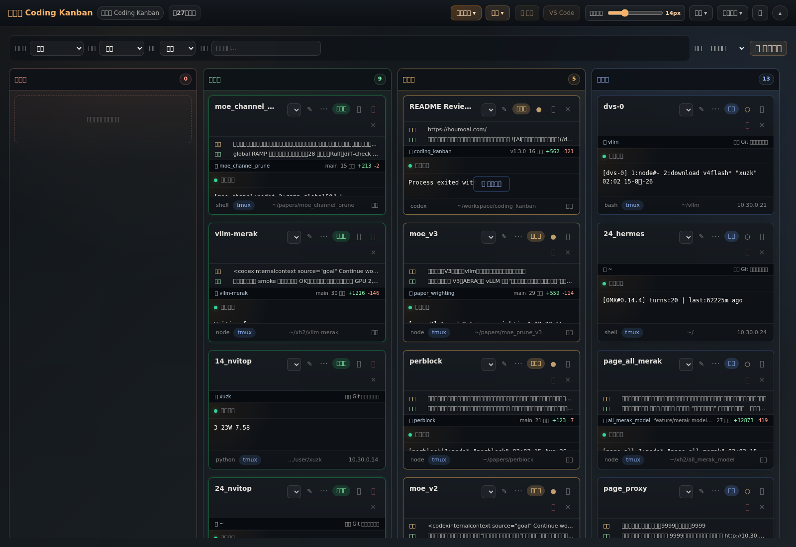

看板支持按服务器、Agent 类型、tmux、标签和目录筛选；支持按最近活动、项目和名称进行列内排序。用户分组嵌套在状态列中，同一个分组在四列内分别控制展开和收起。

下面的视图同时展示了排序菜单、结构化任务/回复摘要、Git 分支和增删行统计。摘要优先来自 Agent 的结构化对话记录，不调用大模型二次生成。

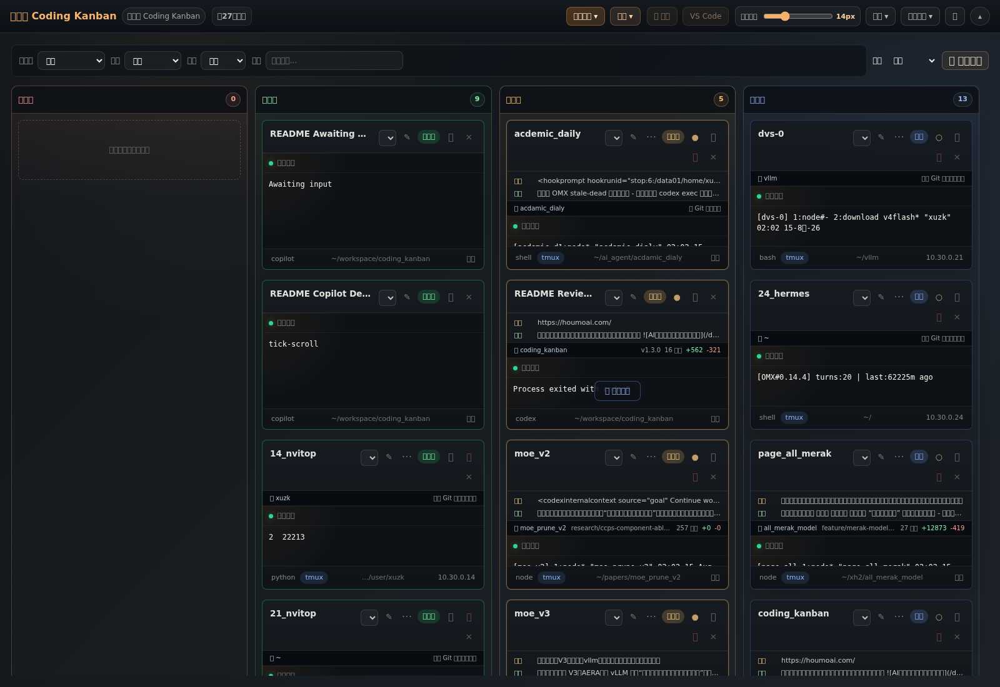

### 2. 聚焦终端与多屏监控

双击卡片进入聚焦视图。主窗格是真实可输入的 xterm 终端，右侧继续保留全部会话上下文。

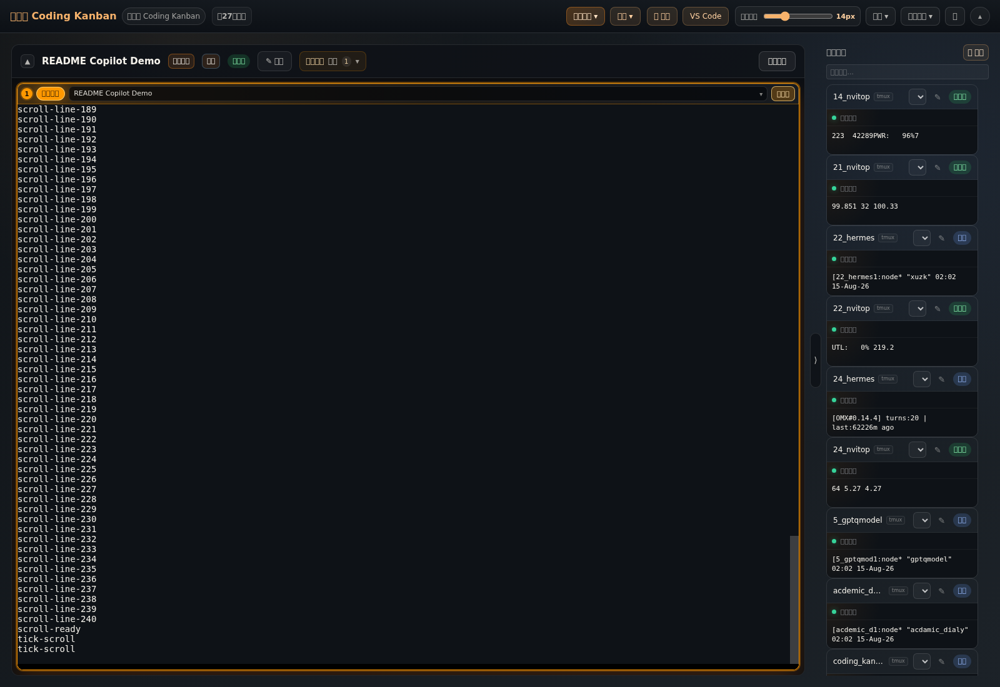

支持单屏、左右双屏、上下双屏、三屏、四屏、六屏和八屏。多个窗格可以同时接收输出，但键盘输入始终只发送给带“当前输入”标识的一个窗格，避免误广播。

右侧会话卡片可以拖入窗格，窗格之间也可以拖拽换位；布局、slot 会话和当前输入窗格会保存到浏览器本地并在刷新后恢复。

### 3. 新建独立会话

每次只创建一个独立会话。可以选择：

- 本机或 SSH 主机。
- `copilot`、`codex`、`claude` 或 `shell`。
- `direct` 或受管 `tmux` 模式。
- 工作目录、显示名称和所属用户分组。

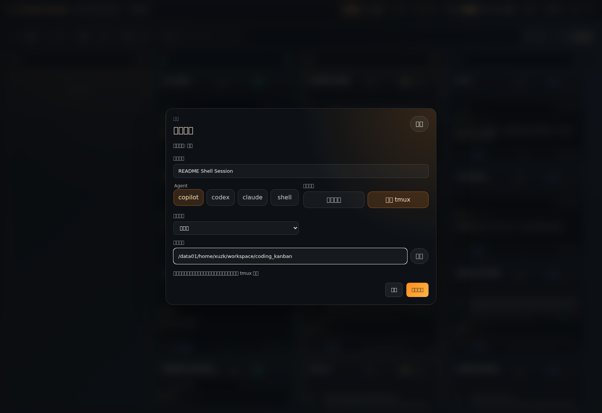

推荐使用受管 tmux：应用更新或后端重启后可以重新 attach；direct PTY 只能保留卡片元数据，无法恢复原进程。

### 4. 快速连接与扫描 tmux

按 `Ctrl/⌘+E` 打开快速连接。目标 session 存在时 attach，不存在时创建。

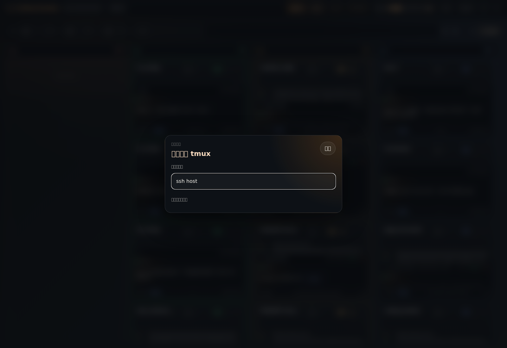

扫描入口支持本地或 SSH 远端：

- 扫描 tmux pane 并加入看板。
- 扫描 Agent 工作目录，识别 Copilot 会话状态。
- 合并能够确认属于同一会话的 tmux 与 Agent 记录，减少重复卡片。

Agent 工作目录扫描会先列出识别到的会话，由用户确认后再加入看板：

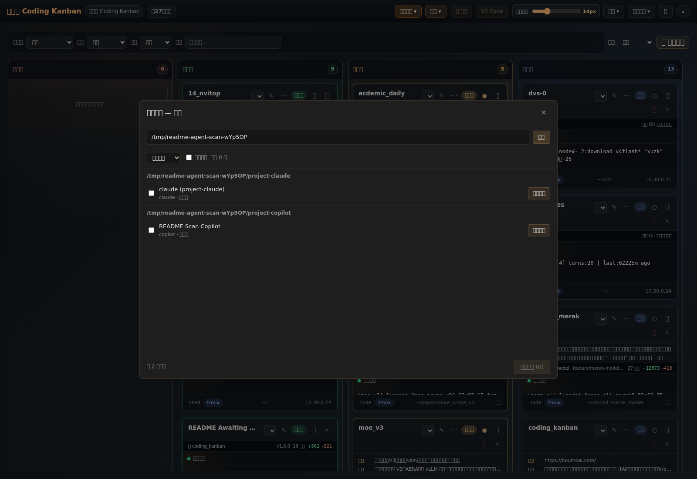

tmux 扫描会展示 session/window/pane、工作目录、前台命令及当前接管状态：

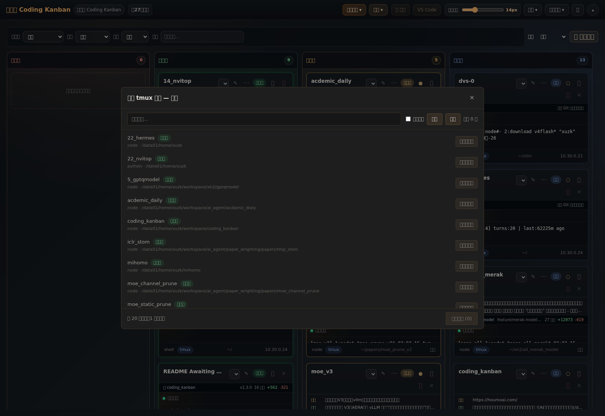

### 5. 文件浏览器

聚焦终端旁边可以展开文件浏览器，终端上下文不会丢失。

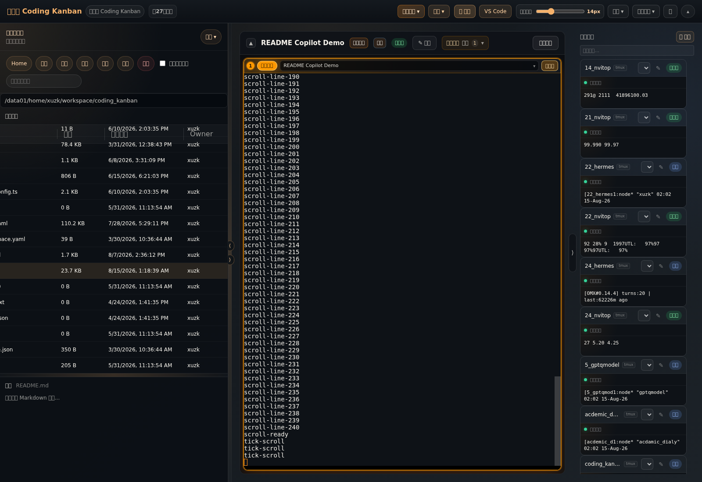

支持：

- 本地文件系统和 SSH/SFTP。
- 面包屑、上一级、过滤、隐藏文件和排序。
- 名称、大小、修改时间、Owner、权限及可拖动列宽。
- 文本预览、编辑和保存。
- Markdown 编辑/预览/分屏，以及 GFM、表格、任务列表和 KaTeX。
- 新建、重命名、删除、chmod、上传、下载和拖拽上传。
- 右键复制路径、下载、上传到目录、重命名、删除和 chmod。

### 6. VS Code Web

本地和 SSH 会话都可以在当前工作台打开 VS Code Web。

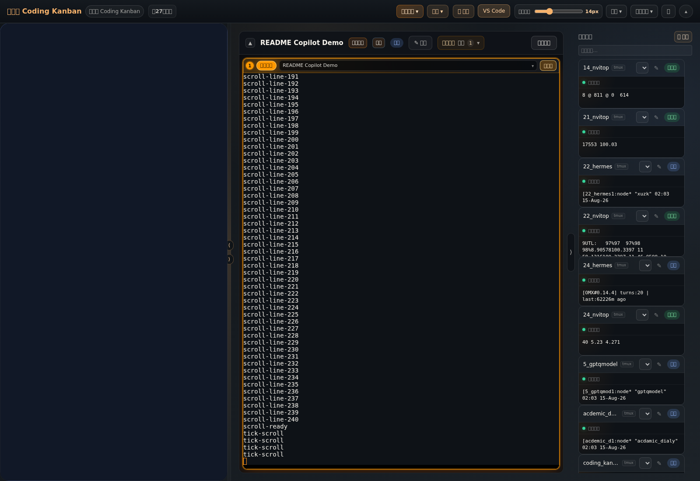

后端优先复用 `code-server`，其次支持 `openvscode-server`；本机未安装时可以尝试安装官方 standalone。SSH 模式通过本地转发代理远端 code-server。

浏览器默认使用“省内存”模式，只保留当前 iframe；“保持状态”模式最多保留最近 3 个 iframe，也可以手动释放隐藏 iframe。

### 7. Git Changes 与双 Diff Review

聚焦页的“变更”入口区分两个完全不同的语义：

- **本次任务**：本机 Codex 根据最新用户任务后的结构化文件操作记录归因。
- **当前工作区**：根据该会话真实工作目录读取 checkout 的 Git 状态和 Diff。

面板支持按路径筛选文件、按状态分组、查看增删统计、复制路径、引用文件到输入框，以及把当前文件内容放大到全屏 Diff。任务记录无法可靠归因时会明确降级，不会拿当前工作区 Diff 冒充 Agent 本次修改。

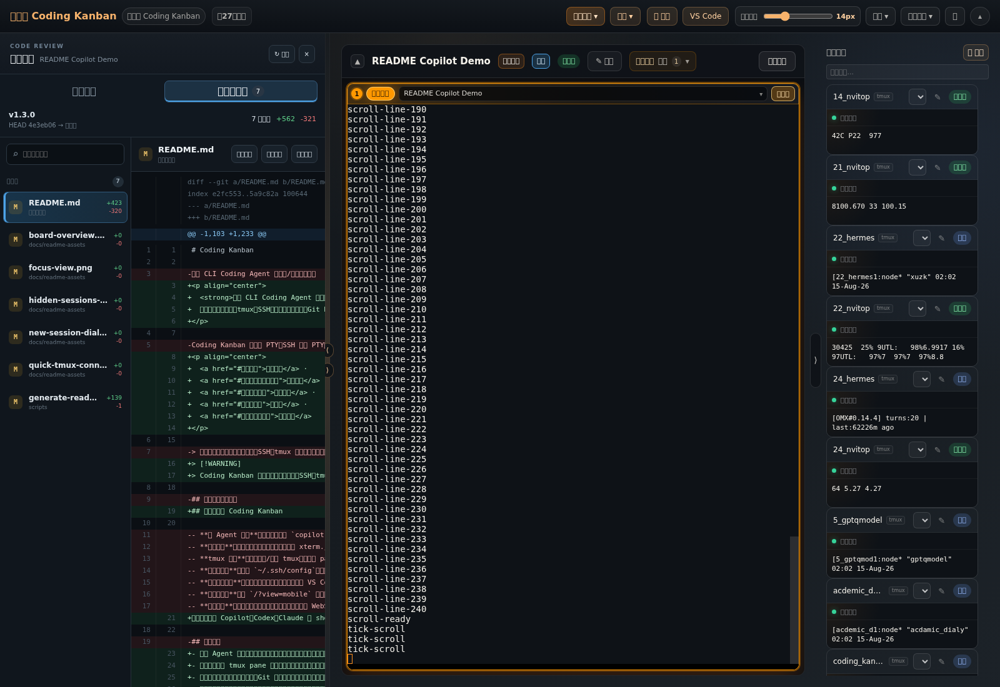

全屏模式保留文件选择、Diff 统计与操作入口，适合审查长文件或在较小窗口中查看变更：

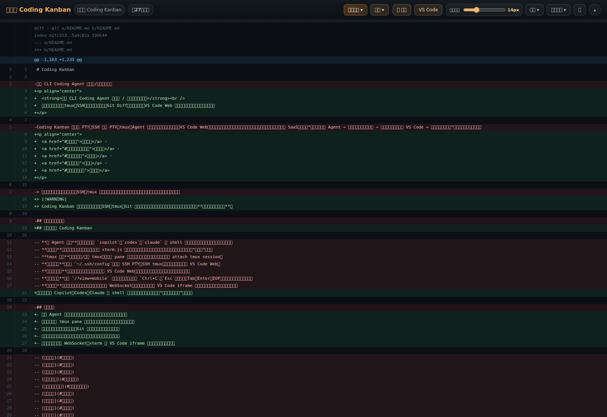

### 8. 结构化任务摘要与完整记录

本机 Codex 以及绑定本地 tmux 的 Agent 卡片会优先读取结构化 JSONL：

- 卡片只提取最新用户指令和最新 Agent 回复。
- 不调用大模型重新总结。
- 清理空白和 Markdown 标记，并做长度限制。
- 找不到结构化记录时回退到轻量终端预览。

聚焦页和手机当前会话都提供“完整记录”：用户消息与最终回答使用安全 Markdown/GFM/KaTeX 渲染，工具过程折叠，`exec` 调用及其输出不展示，避免日志噪声覆盖真正对话。

### 9. 手机工作区

手机端入口：

```text
https://<局域网地址>:<WEB_PORT>/?view=mobile
```

兼容 `/mobile`、`/m` 和 `#/mobile`。

手机首页先展示轻量注意力看板，不会为每个会话创建真实终端。底部导航包括：

- 看板
- 活动
- 当前会话
- 项目/文件

进入当前会话后才挂载真实终端。快捷键栏提供 `Ctrl+C/D`、`Esc`、`Tab`、`Shift+Tab`、方向键、清屏和常见行编辑控制键；单指滚动终端历史，双指缩放字号。

手机变更视图使用下拉框选择文件，避免完整文件列表占满屏幕；Diff 可以全屏查看，并支持复制路径或引用到输入框。

| 手机注意力看板 | 当前会话终端 | 手机 Changes |
| --- | --- | --- |
| 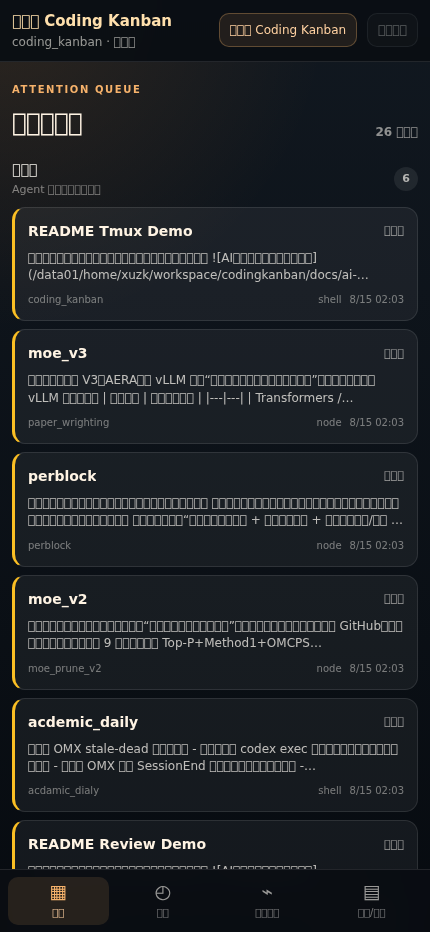 | 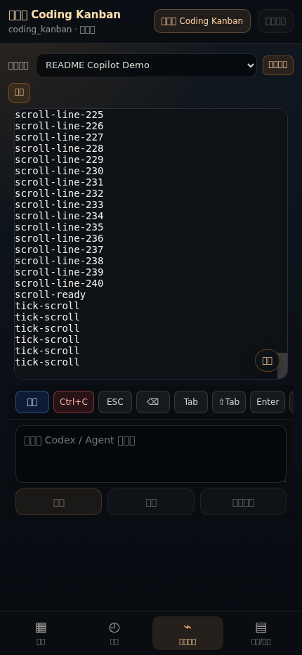 | 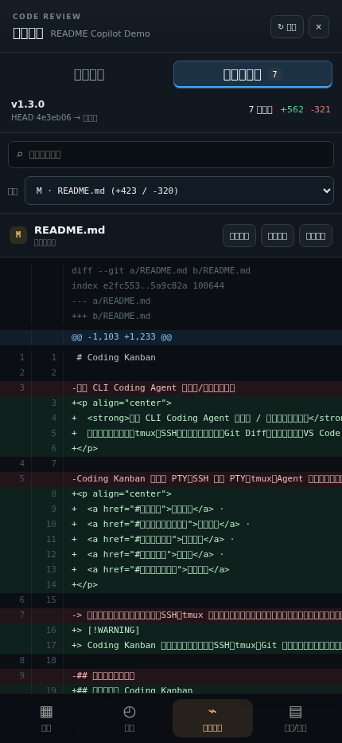 |

### 10. 隐藏会话与安全操作

低优先级会话可以隐藏到抽屉，而不是直接删除。

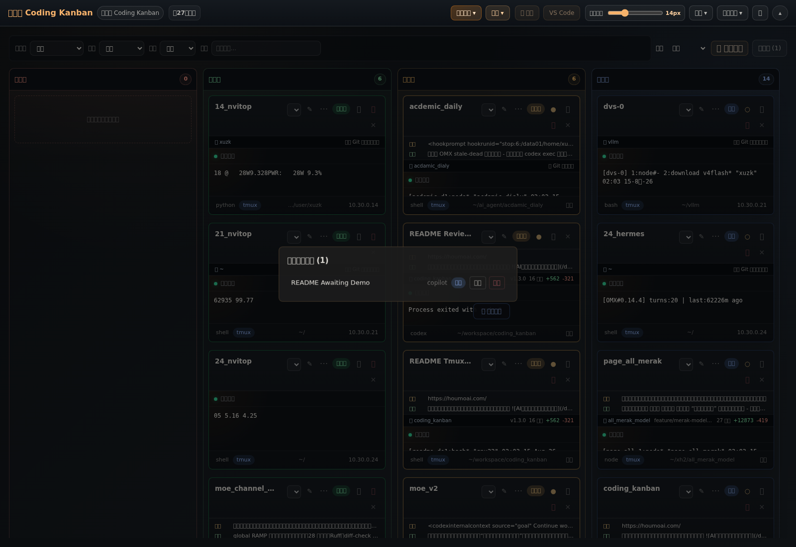

隐藏不会终止底层进程。关闭 direct 会话、终止 tmux 等破坏性操作会明确展示确认；tmux 的“脱离会话”和“终止底层 session”是不同操作。

### 11. 设置、资源调节与通知

顶栏使用统一“设置”入口，内部包含三个分类：

- **工具**：操作提示、当前浏览器的任务完成通知和测试通知。
- **资源调节**：轻量/完整终端预览、VS Code iframe 缓存、手动释放缓存和资源诊断。
- **飞书通知**：分别控制所有已登记看板任务的完成提醒，以及私聊回复继续执行；开启前已经运行的会话后续完成时同样发送，目标必须先在本地 `.env` 配置，页面不会读取或展示具体接收者 ID。回复控制默认关闭，群聊目标不能开启。

默认轻量预览不为每张卡片创建 xterm 和终端 WebSocket。需要实时小终端时，可以手动切换到完整预览。

资源诊断按需显示：

- 挂载中的 xterm 和终端视图。
- 活跃/隐藏终端 WebSocket。
- 会话快照吞吐和终端实时流吞吐。
- PTY replay 是否裁剪。
- 当前/隐藏 VS Code iframe。
- VS Code 代理 HTTP/WS 吞吐。
- 主线程 long task 和 Chromium JS heap。

高频终端输出触发的全量看板快照会在后端合并广播，卡片摘要请求也按时间桶刷新，避免持续输出形成请求风暴。

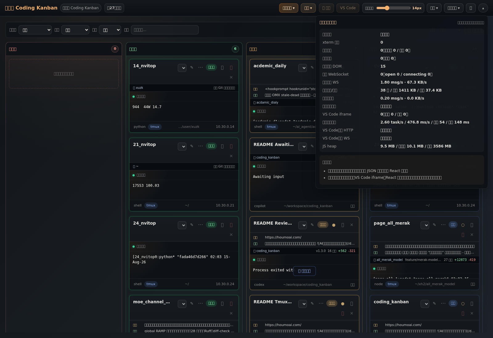

### 12. 演示视频

<video src="docs/readme-assets/20260423_151840.mp4" controls muted playsinline width="100%"></video>

如果 Markdown 渲染器不支持内嵌视频，请直接打开：

[查看演示视频](docs/readme-assets/20260423_151840.mp4)

## 快速开始

### 环境要求

必需：

- Git。
- Node.js 20 或更高版本。
- pnpm；仓库声明使用 `pnpm@10.13.1`。
- `curl`、`lsof` 和 OpenSSL；推荐启动脚本使用它们检查服务、端口和生成 HTTPS 证书。
- Linux 使用推荐启动脚本时需要 `setsid`，通常由 `util-linux` 提供。

按需：

- `tmux`：扫描、创建、接管和恢复 tmux 会话。
- OpenSSH 客户端：SSH PTY、远端 tmux、远端文件和远端 VS Code。
- `mkcert`：为局域网生成浏览器可信任的本地 HTTPS 证书，强烈推荐与 VS Code Web 一起使用。
- `code-server` 或 `openvscode-server`：内嵌 VS Code Web；未安装时应用可尝试通过网络安装 `code-server`。
- Codex、Copilot 或 Claude CLI：只需安装并登录实际要从看板启动的 Agent；纯 shell 会话不需要。
- `lark-cli`：仅发送飞书提醒或从飞书回复继续 Codex 时需要。
- Playwright 浏览器和系统依赖：仅运行 E2E 或生成 README 截图时需要。

```bash
# Ubuntu / Debian
sudo apt update
sudo apt install -y git curl lsof openssl util-linux tmux openssh-client

# Fedora / RHEL
sudo dnf install -y git curl lsof openssl util-linux tmux openssh-clients

# macOS
brew install git node tmux openssl mkcert

# 安装 Node.js 20+ 后，启用仓库声明的 pnpm 版本
corepack enable
corepack prepare pnpm@10.13.1 --activate
```

如果 `pnpm install` 在构建 `node-pty` 时报告 `node-gyp` 错误，再安装 Python 3、`make` 和 C/C++ 编译工具链。macOS 若没有可用的 `setsid`，可以使用下文的 `pnpm dev` 启动方式。

### 新用户安装检查清单

首次启动前，建议从上到下逐项确认。

基础启动：

- [ ] `git --version`、`node --version` 和 `pnpm --version` 均可执行；Node.js 至少为 20，pnpm 建议为 `10.13.1`。
- [ ] `curl`、`lsof`、`openssl` 可执行；Linux 使用 `restart-dev.sh` 时，`setsid` 也可执行。
- [ ] 已运行 `pnpm install`，且 `node-pty` 没有原生编译错误。
- [ ] 已执行 `cp .env.example .env`，并只在 `.env` 中填写本机路径、端口和通知接收者。
- [ ] `.env` 仍被 Git 忽略，没有把 Token、SSH 私钥、App Secret 或个人飞书 ID 加入暂存区。
- [ ] 后端端口和前端端口未被其他服务占用；默认分别为 `4000` 和 `8484`。
- [ ] 局域网访问时保留 `WEB_HOST=0.0.0.0`，并确认防火墙允许前端端口。

按需功能：

- [ ] **tmux 会话恢复**：`tmux -V` 可执行；本地和准备连接的 SSH 主机都已安装 tmux。
- [ ] **Coding Agent**：需要使用的 `codex`、`copilot` 或 `claude` 命令已加入 `PATH` 并完成登录；远端会话还需在远端主机安装。
- [ ] **SSH 工作流**：`ssh -V` 可执行；可使用 `~/.ssh/config` 中的预设主机，也可在“新建会话 → 新增 SSH 连接”直接填写目标。请先确认本机 `ssh-agent`、SSH 配置或私钥能够免交互登录。
- [ ] **可信 HTTPS**：已安装 `mkcert`，或配置自己的可信证书；手机和其他局域网设备已信任对应 CA。只接受 OpenSSL 自签警告可能导致 VS Code Web 的 Service Worker、图片或 webview 无法加载。
- [ ] **VS Code Web**：本机/远端已有 `code-server` 或 `openvscode-server`；若依赖自动安装，已确认机器可以访问 `code-server.dev`。
- [ ] **飞书提醒**：`lark-cli` 已配置机器人身份和 `im:message:send_as_bot` 权限，`.env` 中只设置 `FEISHU_NOTIFY_CHAT_ID` 或 `FEISHU_NOTIFY_USER_ID` 其中一个；Kanban 后端会统一发送 Codex 最后一条完整回复，无需为新安装单独配置 Codex 用户级 notify hook。确认目标会话允许接收可能包含代码和日志的完整正文。
- [ ] **飞书回复续跑（可选）**：仅使用私聊 `FEISHU_NOTIFY_USER_ID`；应用已开通 `im:message.p2p_msg:readonly`，并在飞书开放平台订阅 `im.message.receive_v1` 长连接事件。群聊目标只能接收通知，不能启用回复控制。
- [ ] **飞书开关**：启动后进入“设置 → 飞书通知”，确认目标类型，再分别按需开启“任务完成通知”和默认关闭的“飞书回复继续执行”。
- [ ] **E2E/截图**：只有需要运行 Playwright 时才执行 `npx playwright install`；Linux 缺少 Chromium 动态库时再执行 `sudo npx playwright install-deps`。

可以先运行下面的命令快速核对基础命令；带“可选”的项目没有输出时，只会影响对应功能：

```bash
git --version
node --version
pnpm --version
curl --version | head -n 1
lsof -v 2>&1 | head -n 1
openssl version
command -v setsid || true       # Linux 推荐启动脚本需要
command -v tmux || true         # 可选：tmux 工作流
command -v ssh || true          # 可选：SSH 工作流
command -v codex || command -v copilot || command -v claude || true
command -v mkcert || true       # 可选但推荐：可信局域网 HTTPS
command -v lark-cli || true     # 可选：飞书完成提醒
```

### 安装

```bash
git clone <your-repo-url>
cd coding_kanban
pnpm install
cp .env.example .env
```

### 推荐启动

```bash
./scripts/restart-dev.sh
```

脚本会：

1. 在停止旧后端前捕获可迁移会话状态。
2. 校验并释放目标端口。
3. 启动 Fastify 后端和 Vite 前端。
4. 默认启用 HTTPS，并准备开发证书。
5. 绑定前端到 `0.0.0.0`，输出 Local、Network、健康检查和日志地址。

局域网访问示例：

```text
https://10.30.0.22:8484
```

实际端口以 `.env` 和脚本输出为准。

### 其他启动方式

```bash
pnpm dev

# 或分别启动
pnpm --filter server run dev:app
pnpm --filter web run dev:app
```

健康检查：

```bash
curl http://127.0.0.1:4000/api/health
```

## 配置说明

所有机器相关配置都放在被 Git 忽略的 `.env` 中。完整注释见 [.env.example](.env.example)。

### 服务与 HTTPS

| 变量 | 默认示例 | 说明 |
| --- | --- | --- |
| `SERVER_BIND_HOST` | `0.0.0.0` | 后端监听地址 |
| `PORT` | `4000` | REST + WebSocket 端口 |
| `WEB_HOST` | `0.0.0.0` | Vite 监听地址，局域网联调必须可见 |
| `WEB_PORT` | `8484` | 前端端口 |
| `WEB_BACKEND_HOST` | `localhost` | Vite 代理目标主机 |
| `WEB_BACKEND_PORT` | `4000` | Vite 代理目标端口 |
| `WEB_HTTPS` | `1` | 默认 HTTPS；局域网 Notification 需要安全上下文 |
| `VITE_DEV_HTTPS_CA_CERT` | 可选 | 可公开下载并用于信任前端证书的 CA 公钥证书 |

### 终端与持久化

| 变量 | 默认示例 | 说明 |
| --- | --- | --- |
| `TERMINAL_SCROLLBACK_BYTES` | `4194304` | 每个活跃 PTY 的后端 replay 字节上限 |
| `TERMINAL_TMUX_CAPTURE_LINES` | `20000` | tmux observe/refresh 捕获行数 |
| `TERMINAL_REGISTRY_OUTPUT_ENTRIES` | `5000` | 无 live PTY 时的 registry 回放条目 |
| `VITE_TERMINAL_SCROLLBACK_LINES` | `20000` | 浏览器 xterm scrollback 行数 |
| `SESSION_STATE_PATH` | `.dev-runtime/agent-sessions.json` | 可恢复会话元数据；不保存终端正文和凭证 |
| `GIT_AUTO_PULL_INTERVAL_MINUTES` | `10`、`30` 或 `0` | 后台只 fetch/check，绝不自动 pull |

### 文件与 VS Code Web

| 变量 | 说明 |
| --- | --- |
| `FILE_BROWSER_DEFAULT_LOCAL_PATH` | 文件浏览器首次打开目录 |
| `VSCODE_WEB_EXTENSIONS_DIR` | code-server 共用扩展目录 |
| `VSCODE_WEB_PUBLIC_HOST` | 浏览器访问 `/vscode/` 的公共主机 |
| `VSCODE_WEB_BIND_HOST` | 本地 code-server 内部监听地址 |
| `VSCODE_WEB_REMOTE_BIND_HOST` | SSH 远端 code-server 监听地址，默认 `127.0.0.1` |
| `VSCODE_WEB_REMOTE_PORT` | 远端 code-server 首选端口，默认 `13338` |

### 飞书完成提醒与回复续跑

接收者、正文分片大小和重试参数只写入被 Git 忽略的 `.env`。配置目标后，在“设置 → 飞书通知”分别控制完成提醒和回复续跑；Kanban 后端统一观察所有已登记会话，因此按钮开启前已经运行的任务后续完成时也会发送。Codex 会优先发送结构化记录中的最后一条完整回复，长正文自动分片；Goal 模式内部自动续轮不视为最终完成。使用私聊目标并完成接收事件授权后，回复任意一片通知都可继续它绑定的在线 Codex。设置和短期消息绑定分别保存在 `.dev-runtime/feishu-notification-settings.json` 与 `.dev-runtime/feishu-reply-bindings.json`，不包含个人凭证或正文，也不进入 Git。完整步骤见 [Kanban 任务完成飞书通知与回复续跑](docs/codex-feishu-notifications.md)。

## 完整功能说明

### 会话生命周期与状态

- 会话记录统一使用 `AgentSessionRecord`，包含来源、Agent、工作目录、连接状态、交互状态、摘要、Git 元数据和传输绑定。
- `running → idle/exited` 时产生待验收状态；聚焦查看后确认已读；新输入或恢复运行后清除旧待验收。
- 已读/未读状态随服务端会话状态持久化，刷新页面和跨设备访问保持一致。
- 明确等待输入的会话不会因“查看”而自动清除，只有实际发送输入或底层恢复执行才离开“需响应”。
- 会话支持重命名、隐藏、恢复、关闭、脱离 tmux、终止 tmux 和重连。

### 终端协议与输入兼容

- replay 完成前缓冲 live frame，防止历史与实时输出乱序。
- WebSocket 支持文本 stdin、resize 和 tmux 鼠标等 binary 消息。
- 实时连接异常后以 250ms～5s 有界退避重连；长期停在 `CONNECTING` 时主动回收。
- 支持 DA、DSR、CPR 等终端能力握手，并避免陈旧回复写入 shell。
- 支持 bracketed paste、Safari `insertText` 补救、CSI-u 修饰键、macOS Option/Windows Alt Meta 键。
- 支持 OSC 52 剪贴板，限制 target 和 payload 大小。
- tmux 输入经 attached client 保持当前 pane 语义，兼容 prefix、command-prompt、confirm-before 和 vi status keys。

### SSH 与远端工作流

- 从当前用户 `~/.ssh/config` 读取主机。
- 新建会话前预检远端目录、Agent 命令和 tmux 可用性。
- SSH 会话退出后仍保留最后输出、退出码和重连入口。
- 文件浏览器使用 SFTP，优先显式 identity file，其次标准默认私钥和 SSH Agent。
- VS Code Web 通过 SSH 本地转发访问远端 code-server。

### Git 与变更安全边界

- 卡片 Git 摘要和 Changes 面板使用固定参数的只读 Git 命令。
- 当前工作区 Diff 不执行 stage、discard、commit、merge、rebase、reset 或覆盖。
- 自动更新后台只执行 fetch/check；只有用户确认后才尝试当前 upstream 的 fast-forward。
- 本地修改、未跟踪文件冲突、分支分叉或 Git 失败时保持工作区不变。

### 应用更新与恢复

- 后端计算覆盖 tracked、untracked、branch 和 HEAD 的源码 revision。
- 前端发现新 revision 时显示非模态提示，不会在终端输入过程中自动刷新。
- 用户确认更新后保存恢复意图并 reload；同一 revision 不形成刷新循环。
- managed tmux 在后端重启后重新 attach；不存在的 tmux 不会根据旧命令自动重建。
- direct 会话只能保留 exited 卡片和元数据，需要手动恢复。

### 浏览器资源策略

- 看板默认轻量预览，不为非活跃卡片挂载 xterm。
- 会话数量超过阈值时按视口虚拟化卡片。
- 高频输出触发的全量快照合并到约 1 Hz。
- 卡片任务摘要和 Git 摘要使用分桶刷新，减少持续输出下的请求频率。
- VS Code iframe 默认只保留当前项；保持状态模式最多 3 个。
- 所有轻量动效只使用 `opacity/transform`，并遵循 `prefers-reduced-motion`。

## 典型工作流

### 工作流 A：启动一个本地 Codex 任务

1. 点击“新建会话”。
2. 选择本机、`codex` 和 tmux 模式。
3. 选择工作目录和用户分组。
4. 创建后在“执行中”列观察任务摘要和终端片段。
5. 任务结束后卡片进入“待验收”。
6. 双击查看结果；确认后进入“可继续”。

### 工作流 B：接管已有远端 tmux

1. 在 `~/.ssh/config` 中配置目标主机。
2. 按 `Ctrl/⌘+E`。
3. 选择主机并输入 tmux session 名。
4. 已存在则 attach，不存在则创建。
5. 在聚焦终端继续输入，旁边可以打开远端文件或 VS Code。

### 工作流 C：审查 Agent 改动并反馈

1. 聚焦目标会话。
2. 点击“变更”。
3. 在“本次任务”和“当前工作区”间切换。
4. 按路径筛选或从状态分组选择文件。
5. 点击“全屏查看”阅读完整 Diff。
6. 使用“引用文件”把 `@path` 插入当前输入框，再补充审查反馈。

### 工作流 D：手机接管长任务

1. 手机打开脚本输出的 Network 地址并加 `/?view=mobile`。
2. 在注意力看板中选择需响应或待验收任务。
3. 进入当前会话，使用快捷键和多行输入继续操作。
4. 查看完整记录或变更面板。
5. 手机 Diff 使用下拉框选择文件，必要时全屏阅读。

### 工作流 E：安全更新应用

1. 后台周期性 fetch 发现 upstream 有更新。
2. 页面显示更新提示，但不自动修改工作区。
3. 用户点击确认后执行 fast-forward 检查。
4. 成功后保存 managed tmux 和布局状态并 reload。
5. 有本地修改或分叉时保持原状态，并显示具体冲突原因。

### 工作流 F：调整工具、资源与飞书通知

1. 点击顶栏“设置”。
2. 在“工具”中查看操作提示或控制当前浏览器的完成通知。
3. 在“资源调节”中切换终端预览、VS Code 缓存模式或打开资源诊断。
4. 在“飞书通知”中确认本地目标类型，再分别开启或关闭所有已登记看板任务的完成提醒与私聊回复续跑。

## 快捷键

| 快捷键 | 作用 |
| --- | --- |
| `Ctrl/⌘+E` | 快速连接本机或 SSH tmux |
| `Ctrl/⌘+Shift+S` | 打开本地 tmux 扫描 |
| `Alt+Q` | 从聚焦视图返回看板 |
| `Tab` | 常规焦点切换 |
| `Esc` | 关闭支持 Escape 的弹窗、菜单或全屏 Diff |
| `Shift+Enter` | 跨平台终端换行，避免系统抢占 `Alt+Space` |

## 仓库结构

```text
apps/web/                 React 19 + Vite + xterm.js 前端
apps/server/              Fastify + WebSocket + node-pty + SSH/tmux 后端
packages/shared/          前后端共享 DTO、类型和协议
scripts/                  启动、重启、截图、演示和测试辅助脚本
tests/e2e/                Playwright 端到端测试
docs/                     PRD、架构、功能、排障和截图资源
memories/repo/            仓库级排障记忆，不参与产品运行
```

## 技术栈

- **前端**：React 19、Vite、TypeScript、xterm.js。
- **后端**：Fastify、`@fastify/websocket`、node-pty、ssh2。
- **终端**：本地 PTY、SSH PTY、tmux attach/scan/control。
- **文件**：Node.js 本地文件系统 + SSH/SFTP。
- **编辑器**：code-server / openvscode-server + `/vscode/` 代理。
- **测试**：Node test runner、Playwright。
- **包管理**：pnpm workspace。

## 开发与验证

```bash
pnpm dev          # 并发启动前后端
pnpm dev:restart  # 安全重启开发服务
pnpm build        # 构建 shared / server / web
pnpm check        # 类型检查并构建
pnpm test         # workspace 单元/集成测试 + scripts 测试
pnpm e2e          # Playwright E2E
pnpm format       # 格式化 workspace
```

常用定向命令：

```bash
pnpm --filter web test
pnpm --filter server test
pnpm --filter shared build
```

仓库要求行为改动使用红绿灯测试，并同步维护：

- [docs/func_list.md](docs/func_list.md)
- [docs/debug_list.md](docs/debug_list.md)
- 相关设计或 PRD

## 更新 README 截图

截图脚本会创建临时 demo 会话、操作当前 UI、保存截图并清理会话：

```bash
README_BASE_URL=https://127.0.0.1:8484 \
README_API_URL=http://127.0.0.1:4000 \
NODE_TLS_REJECT_UNAUTHORIZED=0 \
node ./scripts/generate-readme-screenshots.mjs
```

计划生成的主要资产包括：

```text
board-overview.png
board-sorting-and-summaries.png
app-discovery-dialog.png
tmux-discovery-dialog.png
new-session-dialog.png
focus-view.png
changes-review.png
changes-fullscreen-diff.png
file-browser-drawer.png
vscode-drawer.png
resource-diagnostics.png
quick-tmux-connect.png
hidden-sessions-drawer.png
mobile-workspace.png
mobile-terminal.png
mobile-changes.png
```

> [!NOTE]
> 当前服务器若报缺少 `libatk-1.0.so.0`、GTK、Cairo 等 Chromium 动态库，脚本无法启动 Playwright。请在有权限的 Linux 环境执行 `npx playwright install` 和 `sudo npx playwright install-deps`，或在已经具备 Chromium 运行库的机器上生成截图。不要使用真实生产会话生成 README 素材。

## 故障排查

### 页面或健康检查不可用

```bash
./scripts/restart-dev.sh
curl http://127.0.0.1:4000/api/health
```

端口以 `.env` 和启动日志为准。

### 手机或局域网设备无法访问

- 确认 `WEB_HOST=0.0.0.0`。
- 使用启动脚本输出的 Network 地址，不要使用手机上的 `localhost`。
- 放行前端端口。
- HTTPS 首次使用时在设备上信任开发 CA。
- 手机入口追加 `/?view=mobile`。

### SSH 主机列表为空

- 检查当前用户的 `~/.ssh/config`。
- 使用明确的 `Host` 条目。
- 确认当前后端用户可读取配置、私钥或 `SSH_AUTH_SOCK`。

### tmux 不可用

- 本机和目标 SSH 主机都需要安装 tmux。
- 非标准路径可设置 `TMUX_BINARY`。
- “脱离”只关闭当前接入；“终止 tmux”会杀掉真实底层 session。

### VS Code Web 无法打开

- 检查本地或远端是否能运行 code-server。
- 检查 SSH 本地转发和 `/vscode/` 代理。
- HTTPS/局域网环境需要信任开发 CA，否则 Service Worker、webview 或 iframe 可能失败。
- 可检查 `VSCODE_WEB_*` 配置。

### 浏览器内存或网络持续增长

1. 保持轻量预览。
2. 将 VS Code 设为省内存模式。
3. 释放隐藏 VS Code iframe。
4. 打开资源诊断，确认压力来自 xterm、终端 WebSocket、快照、实时流、VS Code 代理还是 heap。
5. 若诊断无明显来源但 heap 持续增长，使用 Chrome Heap Snapshot 对比 retained objects。

### Playwright 无法启动

若报缺少 `libatk-1.0.so.0` 等系统库：

```bash
npx playwright install
sudo npx playwright install-deps
```

无系统权限时仍可运行：

```bash
pnpm test
pnpm check
```

## 部署安全与边界

- 仅部署在可信本机或内网，不提供公网多租户安全边界。
- 不提交 `.env`、Token、SSH 私钥或主机相关凭证。
- 后端命令、路径和主机参数必须经过固定参数调用或严格校验。
- 自动更新不接受 HTTP 传入 remote、branch、ref、仓库路径或任意 Git 参数。
- 后台定时任务只 fetch/check，不自动 pull、merge、rebase、stash 或 reset。
- Git Changes 当前只读，不提供 stage、discard、commit 或覆盖工作区。
- 多屏终端不广播输入；始终只有一个当前输入窗格。
- direct PTY 无法跨后端重启恢复；需要恢复能力时使用 managed tmux。
- 完整记录和任务归因首版主要支持本机 Codex；远端和其他 Agent 会明确降级。
- 当前不是 Electron 桌面包，默认通过浏览器访问。

## 进一步文档

- [功能清单](docs/func_list.md)
- [项目概览](docs/project-overview.md)
- [Bug 修复记录](docs/debug_list.md)
- [手机终端适配](docs/mobile-terminal-adaptation.md)
- [文件浏览器架构](docs/specs/2026-04-20-file-browser-architecture.md)
- [双 Diff 架构](docs/specs/2026-08-14-dual-diff-architecture.md)
- [Codex 飞书任务完成通知](docs/codex-feishu-notifications.md)
- [v1.4.0 PRD](docs/plans/2026-08-12-v1.4.0-prd.md)

## License

参见 [LICENSE.txt](LICENSE.txt)。
