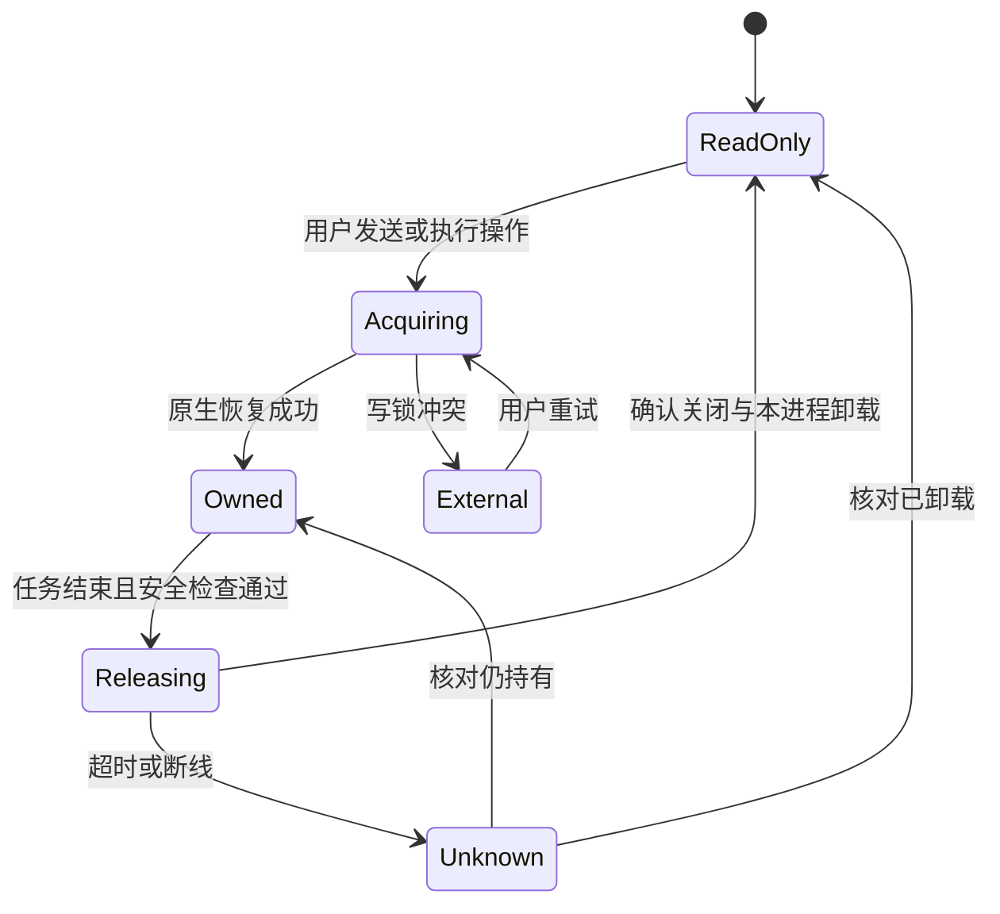

# 会话写入占用、空闲释放与跨客户端恢复方案

状态：用户已确认，已实施；正式运行层待安全窗口启用。日期：2026-10-08。

实现说明见 [执行权与交接](../session-ownership.md)，执行证据见 [验收记录](session-ownership-acceptance.md)。

目标：同一 Codex 会话可在 Coding Kanban 和 Codex CLI/IDE 间安全交替使用；仅查看历史、保留标签、编辑草稿不长期占有写锁。第一阶段不承诺强制夺取其他客户端仍持有的会话，也不接入官方应用的私有 IPC 来代理其他客户端操作。

## 1. 调研对象与结论

以用户指定的 `third_party` 包为准，并非本机已安装插件的当前行为推断。

| 对象 | 版本与材料 | 已确认行为 |
| --- | --- | --- |
| `third_party/ChatGPT.app` | Info.plist：26.924.22138 / 11645；bundle ID 为 `com.openai.codex`；读取 app.asar 中打包 JS | owner/follower 协作、闲置取消订阅、写锁冲突识别与历史读取降级 |
| Linux / Windows VSIX | `openai.chatgpt-26.51002.51308-*`；包内显示名称 Codex；Linux CLI 0.162.0-alpha.2 | 与应用相同的核心闲置策略和 IPC 角色；两平台 extension.js 与主会话管理 bundle 哈希一致 |
| `third_party/codex` | 源码快照 `0a2a64e942` | 原生独占 writer 锁、取消订阅、延迟卸载、只读历史 API、CLI 写锁冲突后的只读回退 |
| 当前正式运行的 Codex | 从既有进程可执行文件查询：0.159.2 | 在隔离数据目录启动同一可执行版本，验证实际协议，未操作正式会话 |

### 1.1 应用与插件不是每轮结束立即释放

两份打包代码都有闲置拥有者回收器：

- 普通闲置会话 TTL 为 `108e5 ms`，即 **3 小时**，最多保留 **10 个**闲置 owner 会话；超过数量时优先取消较早闲置者的订阅，不必等满 TTL。
- 正在查看的会话、有 follower 或 follower 正在重连的会话不进入该普通回收分支。
- active 状态、仍进行中的轮次、未得到服务端消息身份的发送占位等会阻止回收。
- 回收调用 `thread/unsubscribe`，前端标记 `needs_resume`；失败安排 15 秒后重试。清理被动阅读缓存是另一个分支，不等于原生写锁已释放。

以上是这两份包的实现常量，不代表所有版本，也不适合直接照搬到本项目“回答完后交给 CLI”的目标。

### 1.2 应用与插件主要通过 owner/follower 共享已有执行者

包内包含本地 `codex-ipc` 通道及 `thread-owner-discovery`。owner 接收原生事件，向 follower 广播带 revision 的完整快照或增量；follower 核对 ownerClientId 和 baseRevision，并把开始、引导、中断、审批、回答、队列操作转给 owner 执行。owner 消失时标记需要恢复，重新建立归属。

这解释了应用和插件之间的协作：部分场景无需释放原生写锁再抢占。**IPC 的显示/操作 owner 和原生进程的写锁是两层身份**，不应混为一谈。VSIX 的本地主路径仍启动自身的 stdio `codex app-server`；应用另有条件启用共享 daemon 的分支，不能概括为所有客户端默认共享同一进程。

独立 CLI 并不因此自动获得上述私有会话操作代理。源码中的 CLI 遇到 active-writer 冲突可回退为只读展示；并不是任意客户端都能无条件接管。

### 1.3 取消订阅回执不是释放完成

原生卸载条件是没有订阅者且没有活动，经过服务端延迟后执行线程关闭，随后发出 `notLoaded` / `thread/closed`。`unsubscribed` 只确认取消了当前连接的订阅。重新订阅会取消卸载倒计时；其他订阅者还在时不能期待释放。

官方当前页面写的默认等待为 30 分钟；本仓库源码默认 `thread_unload_delay_secs=60`，本次两个可执行版本均接受显式配置为 2 秒。设计依据是可配置机制和实际关闭回执，不依赖一个跨版本固定默认值。

官方协议补充来源：[Codex App Server](https://learn.chatgpt.com/docs/app-server)，其中明确区分 `thread/read`（不加载、不订阅）和 `thread/resume`，并说明取消订阅后的延迟卸载。包内策略及私有 IPC 结论来自本地代码，不由该文档推断。

### 1.4 隔离探测结果

对 0.159.2 与 VSIX 0.162.0-alpha.2 各启动两个独立临时 app-server，共用各自隔离的临时历史目录。使用合成历史，不发送模型请求。

| 验证 | 两个版本的结果 |
| --- | --- |
| A 恢复后空闲，B 尝试恢复同一 ID | B 得到 active-writer 冲突 |
| A 持锁时 B 调用只读 thread/read | 成功 |
| A 取消订阅立即检查写锁 | 仍被占用 |
| 显式卸载延迟 2 秒，等待后检查 | 约 2.2 秒释放，收到 thread/closed，loaded/list 不再包含会话 |
| B 再次恢复同一 ID | 成功，无需创建副本 |
| B 持锁时 A 读取历史 | 成功，A 的 loaded/list 仍为空 |
| 后台终端列表、goal/get 能力 | 两版本均支持；临时线程返回空终端列表 |

探测进程均已退出，正式进程未重启。证据见 `.dev-runtime/session-ownership-research/protocol-probe-results.json`、`probe.py`。

## 2. 当前项目需要修正的边界

当前 `setCurrentThread`、关注历史恢复、缺失消息核对等路径使用 `threadResume`。它虽不启动新一轮，却会加载线程并持有写锁；只补一个 unsubscribe 会被这些读取路径立即重新占用。

当前 Rust HTTP 层未提供完整只读历史及 unsubscribe/loaded-list 接口；Codex 连接由后台长期持有。关闭标签只改变关注集合，不取消该后台连接的订阅。

原生卸载会调用 `shutdown_session_runtime`，其中包含 `unified_exec_manager.terminate_all_processes()`。所以仅依据 `idle` 自动卸载，可能结束会话仍管理的后台命令。后台终端、子 Agent、待审批/待回答、自动继续目标都必须纳入判定；查询能力缺失或状态不明时保留占用并说明原因。

## 3. 推荐产品行为

采用 **按需取得写入权、真正空闲后自动释放、外部占用时只读**。借鉴官方的读写分离与身份校验；第一阶段不复制私有 IPC 协议。

| 场景 | 预期行为 |
| --- | --- |
| 打开、刷新、切换、保留标签，查看已完成历史 | 只读加载，不取得写入权；草稿和附件照常保存 |
| 用户点击发送 | 后台串行取得该会话写入权，恢复最新历史/设置，再提交一次原消息 |
| 当前任务及连续队列完成 | 资源检查通过后取消订阅；默认原生卸载延迟 2 秒，通常约 2–5 秒完成，以关闭确认而非计时到点为准 |
| 标签仍在前台、用户正在写下一条草稿 | 不阻止空闲释放；编辑文字不是执行任务 |
| 生成、自动重试、等待审批/回答、后台命令、活动目标/子 Agent | 保留执行权；说明仍有后台工作，而不是假报已释放 |
| 关闭标签或全部浏览器窗口 | 阅读兴趣撤销；已授权运行和连续队列继续，真正空闲后由后台释放 |
| CLI/插件已持有写锁 | 显示“其他客户端正在使用，可查看历史”；保留草稿/附件和待发送内容，提供“重新连接并发送” |
| 本项目正在释放，用户又发送 | 排队等待本次释放结果，再恢复；关闭中的有限重试不得重发已送达或送达不明的消息 |
| 空闲时点击“释放给其他客户端” | 在同一安全判定下启动释放，确认后显示“本项目已释放” |
| 其他客户端实际释放后返回网页 | 显式发送/重新连接时尝试恢复同一 ID；阅读刷新不会自动抢回执行权 |

手动释放入口放在会话更多菜单。若仍有后台工作，提示具体原因并保留占用；“停止任务后释放”若以后加入，应是单独的显式操作，不把它隐含在关闭标签或普通释放中。

“已释放”表示本项目释放了执行实例。并不保证另一客户端没有紧接着取得写锁；也不把外部客户端的实际运行状态凭空标成空闲。

第一阶段能够保证本项目不再无故长期占用会话，不能保证让仍持锁的官方插件立即让出会话。关闭对方的窗口也未必等于它实际释放；如果需要在对方仍运行时直接协同发送，应另行选择第 7 节的共享后台或 IPC 路线。

代价：下次发送需要恢复执行环境，可能多一次短暂加载；MCP/工具缓存可能重建。后台命令仍在时不自动释放，避免为切换客户端结束工作。

## 4. 状态与后端协调

将状态分为三个维度：历史加载状态、轮次执行状态、会话访问状态。上轮失败与当前被其他客户端占用分别展示，避免再次把占用冲突误报为模型执行失败。

后台按 `(runtimeInstance, threadId, generation)` 记录生命周期；每个会话的取得、执行、释放串行化。多个浏览器共用一个执行者，浏览器离线不是后台任务结束的证据。

释放必须同时满足：

1. 最新轮次已终止，且没有启动、引导、回滚、审查、压缩、设置写入等进行中的操作。
2. 没有未处理的审批、问题或 MCP 交互回执。
3. 没有正发送、准备继续的队列项或送达不明事项。已暂停队列可在确认无执行任务后释放，其内容继续持久保留，后续显式恢复时重新取得写入权。
4. 活动目标、子 Agent 和原生后台终端均已核对；无法确认这些资源是否安全时不自动卸载。
5. 同一 generation 在安全检查后仍有效；新发送或新活动到来时撤销未发出的释放请求。

unsubscribe 回执后维持 Releasing。等待 `thread/closed` 并核对 `thread/loaded/list`；丢事件时通过只读核对收敛，超时维持可解释的未知状态。旧实例或旧一代释放事件不得清空新一代的输入、审批和运行状态；缺少足够身份信息的关闭通知先核对当前运行层。

队列投递结果未知时保留原提交 ID，通过原生消息 clientId/回执核对，不把“重新连接”当作重新提交。CLI 写锁冲突不转换为一次失败的模型 turn。

所有会取得线程运行实例的入口共用这一协调层，包括普通发送、队列续发、审查、回滚、压缩、设置修改等。只读历史加载、状态查询、标签恢复不得绕回 resume。

只读快照缺少模型、推理或权限字段时不清空既有设置。真正恢复时以服务端的新鲜回执核对持久设置和本次显式选择，不能把全局默认值覆盖到从 CLI 返回的会话上。

队列排序、失败暂停、显式继续等语义沿用现有实现。本任务负责 Rust 生命周期及前端；队列侧只接入“执行需求/投递中/结果待确认”的小接口，实施时明确补丁归属，避免重写另一位 AI 维护的调度逻辑。

## 5. 实施顺序

1. **只读历史与能力检查。** Rust 层补 `thread/read`、`thread/turns/list`、必要的 `thread/items/list`、`thread/loaded/list`；兼容 legacy 与分页历史。前端导航、刷新、关注历史同步、缺失消息核对改走只读路径。旧版本能力不足时明确降级，不通过偷偷 resume 来实现阅读。
2. **统一执行入口。** 增加后台会话访问协调器和每线程串行化；发送前恢复，保留原 ID、模型、推理强度与权限。接通现有队列的最小状态接口；关闭/失败/重连消息都遵循实例与 generation 规则。
3. **安全释放。** 补 unsubscribe 和资源核对能力；仅给本项目拥有的 Codex 子进程配置卸载延迟，不修改用户全局 config.toml 或共享 daemon。加入自动释放、释放中、超时核对与手动释放入口。
4. **外部占用体验。** 只读查看、占用提示、草稿保留、显式重连发送；不根据未验证信息把占用者硬标成 CLI 或 VS Code。
5. **矩阵验收与文档。** 红绿灯测试先覆盖写锁与状态竞态，再做独立运行环境中的跨进程、浏览器验收。同步功能清单、状态文档和 bug 记录。

改动区域预计为 `packages/session-runtime/crates/codex/src`、`packages/session-runtime/web/src`、`apps/web/src/session-mode/services` / stores / 会话菜单，以及 `apps/server` 队列适配接口。具体新文件和接口命名在实施阶段确定。

## 6. 最小验收矩阵

| 验收组 | 必须证明 |
| --- | --- |
| 纯阅读 | 刷新、切换、网格、多窗口、历史补拉不增加原生 loaded 会话，不抢 CLI 写锁 |
| 普通完成/失败/停止 | 真空闲后释放；历史、标题、附件与输入内容不丢；失败暂停仍需显式继续 |
| 连续执行 | 队列下一条已就绪、自动重试、目标自动继续时不在两轮间卸载 |
| 交互等待 | 审批、问题、MCP 等待保持有效，不因空闲显示或窗口关闭丢失 |
| 后台资源 | 有长命令、活动子 Agent 时禁止自动释放；资源查询失败同样禁止；关联工作不受影响 |
| 跨进程交替 | 网页释放后独立 CLI 能恢复同一 ID；CLI 真正释放后网页能继续；整个过程不创建替代会话 |
| 同时竞争 | 两个客户端抢占只有一个成功；失败方保持只读和草稿，不篡改历史 |
| 释放竞态 | 新输入与 unsubscribe/closed 交错，旧 closed 晚到，新轮不会被清空或错误标为失败 |
| 断线/重启 | 网关重启、事件缺失重复、发送回执丢失、卸载超时均不假报成功，也不重复提交 |
| 配置和界面 | 模型/推理/权限保持会话级隔离；加载时不抢焦点，关闭标签只取消关注 |

判定“CLI 能继续”要用独立进程实际恢复同一 ID；判定“网页恢复”要核对真正的发送请求及回执。单测里将状态改成 idle、页面显示绿色、或 unsubscribe 返回成功都不能单独作为通过证据。

## 7. 发布与后续边界

本方案已按用户确认实施，原始调研结论保留作为设计依据；验收与正式生效状态单独记录。

实现后先在隔离数据目录和端口完成 Rust、前后端类型检查及局域网浏览器验收。正式 Rust 运行层需要安全切换才能生效；现有活跃 Agent 不会因代码构建自动重启。交付中分别说明“代码通过验收”和“正式实例已生效”，正式切换安排在任务收尾后的安全窗口或用户明确安排的维护窗口。

下一阶段可单独评估两条路线：接入同一个受控 app-server，让 CLI 使用显式 remote 连接；或对接应用/插件的私有 IPC owner/follower。前者涉及后台归属、环境继承和版本兼容，后者还涉及私有协议变动、审批路由与操作鉴权，均不作为第一阶段实现的前置条件。

## 8. 证据索引

分析材料位于 `.dev-runtime/session-ownership-research/`，提取文件及 SHA-256 记录在 `bundle-index.json`，原 third_party 包未修改。

- `app-main.pretty.js:43749`：3 小时 TTL、10 个闲置 owner、15 秒失败重试；`:43835` / `:44064`：回收条件；`:44078`：unsubscribe；`:37107`：follower 快照身份；`:42500`：owner 不可达时恢复。
- `vsix-manager.pretty.js:228393` / `:228740`：插件对应闲置策略；`vsix-extension.pretty.js:104533` / `:104783`：owner discovery 与 follower 操作代理；`:114944`：独立 stdio app-server 启动路径。
- `app/.vite/build/application-network-startup-CY4ZWOz-.js`：受环境及配置条件约束的共享 daemon 分支；不是无条件使用共享后台。
- `third_party/codex/codex-rs/app-server/src/request_processors/thread_lifecycle.rs:56`：无订阅且无活动的卸载条件；`:427`：卸载与关闭确认。
- `third_party/codex/codex-rs/rollout/src/writer_lock.rs:65`：独占写锁；`core/src/session/handlers.rs:291`：关闭线程时清理后台命令的边界。
- `third_party/codex/codex-rs/tui/src/app/session_lifecycle.rs:1349`：CLI 遇到写锁冲突的只读降级；`app-server/tests/suite/v2/thread_unsubscribe.rs`：重新订阅取消倒计时等既有测试。
- `protocol-probe-results.json`：本次两种可执行版本的隔离协议验证结果。没有在 macOS 上启动桌面应用，因此 UI 私有 IPC 协作结论属于包内静态分析，不冒充跨应用端到端实测。
