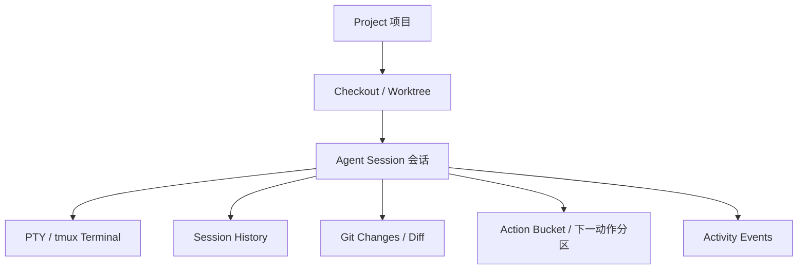

# Coding Kanban v1.4.0 产品需求文档（PRD）

- **文档日期**：2026-08-12
- **最近更新**：2026-08-13（同步四列下一动作语义）
- **目标版本**：v1.4.0
- **产品**：Coding Kanban
- **状态**：待评审
- **产品类型**：本地/局域网 CLI Coding Agent 工作台
- **参考项目**：
  - Orca：`stablyai/orca`，审查提交 `444638d96b015eae81b83ff63dac5a3b160adb3e`
  - Pi Web：`agegr/pi-web`，审查提交 `d2d7f2211332f45481bc7ccdc6c821671decf8ff`
- **审查方式**：已下载两个仓库源码，阅读 README、产品文档、桌面/移动组件、状态模型、文件/Git/会话/通知/终端实现和测试；本 PRD 只提取交互与架构思想，不复制受版权保护的实现代码。

---

## 1. 摘要

Coding Kanban 当前已经具备较完整的终端会话管理基础：本地/SSH PTY、受管 tmux、会话扫描、轻量预览、多屏聚焦、文件浏览器、VS Code Web、手机终端控制、通知、状态持久化和更新恢复。

但产品当前仍以“终端卡片 + 聚焦终端”为中心，缺少两个上游项目已经验证的更高层工作流：

1. **从观察多个 Agent，升级为管理多个独立会话**：任务状态、待处理事项、会话关系、完成/阻塞/需要用户决策等信息没有形成统一视图。
2. **从打开终端，升级为完整的 Agent 工作区**：会话历史、分支、上下文用量、Git 变更、文件预览、快速打开、草稿、命令/技能和移动端 PWA 体验还没有形成连贯工作流。

v1.4.0 的目标不是把 Orca 或 Pi Web 原样移植进来，而是把二者最实用的能力融合为 Coding Kanban 的下一层产品模型：

> **一个以独立 Agent Session 为核心、以工作区和用户任务为边界、以终端为执行面、以移动端为远程控制面的开发工作台。**

v1.4.0 采用“先提升信息密度和任务闭环，再扩展执行能力”的策略。首版优先交付：

- Agent 任务状态看板与统一注意力模型。
- 项目/工作区/worktree 视图。
- 会话历史、重命名、分支与恢复。
- Git 状态和可读 Diff 审查。
- Quick Open、文件上下文注入、草稿与快捷命令。
- 移动端 PWA 工作区、通知和稳定输入。
- 面向未来的自动化和远端执行扩展，但不在首个交付切片中引入多个 Agent 自动协同实现同一目标、高风险的自动 pull、云端凭证托管或复杂图形化浏览器控制。

---

## 2. 产品问题与机会

### 2.1 当前问题

| 问题                                 | 用户影响                                   | v1.4.0 方向                                           |
| ------------------------------------ | ------------------------------------------ | ----------------------------------------------------- |
| 卡片主要展示连接状态，不展示任务语义 | 无法快速判断哪个 Agent 需要处理            | 引入注意力状态、任务摘要、最后输入/输出、完成时间     |
| 会话、主机、目录、分组是平行概念     | 用户需要依靠名称和筛选记忆上下文           | 建立 Project → Worktree → Session 层级              |
| 终端输出是主要历史载体               | 退出、刷新或换设备后上下文难找             | 读取并索引会话元数据，提供历史列表和恢复              |
| 文件浏览器与终端之间连接弱           | 只能手动复制路径或切换面板                 | Quick Open、文件引用、行号引用、拖拽注入              |
| Git 只作为目录下的隐含环境           | 很难直接看到 Agent 改了什么                | 文件状态、增删统计、Diff、审查标注                    |
| 手机端偏终端遥控                     | 手机无法完成“查看结果—追问—审查—继续” | 手机工作区、通知、摘要、文件/Diff 快速查看            |
| 多个独立会话缺少统一组织             | 用户需要逐个查找、切换和记忆上下文         | 提供统一看板、项目归属、标签/分组、活动中心和会话关系 |

### 2.2 机会

Orca 的核心启发是：

- 看板按 `Response Needed / Executing / Review / Ready` 聚合，而不是只按进程状态排列。
- 一个用户任务可以关联项目、worktree、一个或多个独立 Agent Session、PR/Review 和终端；这些会话默认互不协同、互不共享输入。
- worktree 是用户主动隔离不同任务或实验环境的边界，不是自动并行编排机制。
- Diff 行批注、浏览器元素抓取、Quick Open 和自动化把“看见问题”直接连接到“让 Agent 修改”。
- 桌面与手机是同一工作状态的两个控制面。

Pi Web 的核心启发是：

- 以项目聚合会话，worktree 是项目下的 checkout 选择器。
- 会话历史可重命名、继续、导出、删除，并保留父子分支。
- 聊天过程可以折叠，保留最终答案的可读性。
- 输入框同时承载草稿、图片、文件 `@` 引用、slash command、模型/工具/思考级别选择和消息队列。
- 文件查看器同时支持源码、Markdown、图片、音频、PDF、DOCX 和 Git Diff。
- PWA 移动端通过 visual viewport、安全区和 service worker 通知解决真实手机问题。

---

## 3. 目标与非目标

### 3.1 目标

1. 用户在 5 秒内识别所有需要自己处理的 Agent。
2. 用户可以从一个任务卡片进入：终端、会话历史、工作区文件、Git Diff 和移动端控制面。
3. 用户可以把同一项目的 main checkout 与 linked worktree 作为一个项目管理，同时保留每个会话真实工作目录。
4. 用户可以从手机完成：查看状态、查看最后输出、发送追问、处理简单确认、查看文件/Diff、回到桌面深度操作。
5. 用户可以在不改变现有 PTY/tmux 协议的前提下扩展 Agent 适配器和任务状态模型。
6. 所有新增设计逻辑都能用单元测试、组件测试和 Playwright E2E 验收。

### 3.2 非目标

以下内容不作为 v1.4.0 首版必须交付：

- 复制 Orca 的 Electron 原生桌面壳、React Native 原生 App 或其 relay 服务。
- 直接复制 Orca/Pi Web 的源码、文案、视觉资源或具体组件实现。
- 云端多租户、账号体系、云端保存 API Key、模型计费代理。
- 自动执行 `git pull`、merge、rebase、reset、force remove worktree。
- 自动替用户批准高风险 Agent 工具调用。
- 在 v1.4.0 中实现完整浏览器 Computer Use；只定义可扩展入口和安全边界。
- 以“支持所有 CLI Agent”为承诺；首版只保证现有 Agent 类型和可配置 CLI 命令。

---

## 4. 用户与核心场景

### 4.1 目标用户

- **多会话开发者**：同时运行多个彼此独立的 Copilot/Codex/Claude/Shell Agent 会话，并在一个看板中统一管理。
- **远程操作者**：从手机或另一台电脑查看局域网/SSH 主机上的任务。
- **审查者**：希望先看 Diff、测试结果和 Agent 摘要，再决定是否继续。
- **项目维护者**：需要周期性检查仓库健康、测试、未提交改动和卡住会话。

### 4.2 核心用户旅程

#### 场景 A：管理多个独立开发会话

1. 用户分别创建多个独立会话，每个会话拥有自己的 Agent、主机、工作目录和可选 worktree。
2. Kanban 将这些会话按 `Response Needed`、`Executing`、`Review`、`Ready` 统一展示，但不替用户创建任务组或复制提示词。
3. 每个会话卡片显示任务摘要、分支、工作目录和终端预览，并可按项目、标签、主机和状态筛选。
4. 某个 Agent 明确等待用户回答、权限或确认时进入 `Response Needed`，浏览器/手机只提醒对应会话。
5. 用户打开该会话，查看输出、修改文件和 Git Diff，再向同一个会话发送后续指令。
6. 用户可以手动把多个会话标记为同一用户任务、同一项目或同一工作流，但系统不在会话之间自动传递消息、代码或决策。

#### 场景 B：手机处理任务

1. 手机打开 `/?view=mobile`，看到按注意力排序的任务列表。
2. 点击 `Response Needed` 或 `Review` 卡片，查看最后一条 Agent 消息或终端上下文。
3. 通过多行输入框发送追问，或点击快捷命令处理 `Ctrl+C`、`Esc`、`Tab`、方向键等控制。
4. 查看变更文件和简化 Diff；必要时把文件/行号引用注入下一条消息。
5. 任务完成后标记已读，返回任务列表；深度编辑通过“在桌面打开”完成。

#### 场景 C：恢复历史会话

1. 用户按项目或工作目录打开历史。
2. 选择某个会话，查看标题、最后消息、token/资源统计、Git 状态和父子分支。
3. 选择“继续”“从此处分支”或“导出”。
4. 恢复后的会话继续绑定原有 session id、tmux 和稳定工作目录元数据。

---

## 5. 产品信息架构

### 5.1 一级导航

桌面端建议保留当前顶栏入口，并增加三个工作区级入口：

1. **看板**：任务/会话状态总览，默认首页。
2. **项目**：项目、checkout、worktree、主机和会话归属。
3. **活动**：需要用户处理、完成、失败、通知和历史事件。

现有“文件”“VS Code”“扫描”“工具”“资源调节”继续作为上下文工具，不升级为一级导航，避免顶栏拥挤。

手机端采用底部导航或顶部可折叠导航：

- 看板
- 活动
- 当前会话
- 项目/文件

### 5.2 对象层级



说明：

- `Project` 是 Git 根目录或用户选择的工作区根目录。
- `Checkout` 是 main checkout 或 linked worktree；没有 Git 的目录仍可作为单一 checkout。
- `Session` 是当前仓库既有 `AgentSessionRecord` 的产品级扩展，不替换稳定 session id。
- `Terminal` 仍是执行真相来源；所有状态投影必须能回退到当前终端/tmux 状态。
- 多个 `Session` 默认是并列且相互独立的对象；用户任务关联只是组织和导航元数据，不代表 Agent 间存在自动协作关系。

---

## 6. 核心需求

## 6.1 R1：注意力驱动的 Agent Kanban

### 目标

把当前按会话平铺的宫格升级为按任务注意力分列的看板，同时保留用户已有的分组、筛选和多屏监控能力。

### 列与状态

| 列     | 含义                               | 进入条件示例                                | 默认优先级 |
| ------ | ---------------------------------- | ------------------------------------------- | ---------- |
| 需响应 | Agent 明确等待回答、权限或确认     | `awaiting_input`、明确的 ask/permission   | 最高       |
| 执行中 | Agent 正在输出/执行                | `running`                                 | 高         |
| 待验收 | Agent 已结束，但用户尚未查看结果   | 未查看的完成结果、非零退出                  | 高         |
| 可继续 | 当前没有阻塞，用户可以继续使用会话 | 已查看的`idle` / `exited`、`detached` | 中         |
| 隐藏   | 用户主动隐藏，不参与默认看板       | `hidden=true`                             | 不展示     |

四列必须按以下互斥优先级投影，避免把用户注意力、任务生命周期和已读状态再次混为一谈：

1. `interactionState === "awaiting_input"` → **需响应**。只有 Agent 明确等待回答、权限或确认时进入；不得根据静默、普通 shell 提示符或长时间无输出猜测。
2. `interactionState === "running"` → **执行中**。即使存在旧的完成未查看标记，恢复运行或新输入也必须优先回到执行中并清除旧标记。
3. `hasUnreadCompletion === true` → **待验收**。仅表示最近一次运行已经结束且结果尚未查看，不表示 Agent 仍在等待输入。
4. 其余未隐藏会话 → **可继续**。包括已查看的 `idle` / `exited` 和可再次使用的 `detached` 会话。

当前 `F-001` 落地切片使用 `AgentSessionRecord.interactionState` 与持久化的 `hasUnreadCompletion` 完成上述投影。更细的 `attentionReason`、失败/断连原因和通用未读事件仍属于 `F-002` / `F-003`，不能在数据不足时由前端猜测。

状态不是简单替换 `InteractionState`，而是分阶段扩展：

- 当前已落地：`interactionState` 继续表示底层交互状态；`hasUnreadCompletion` 只表示完成结果是否待验收。
- `F-002` 后续扩展：引入 `attentionState` / `attentionReason`，表达权限、失败、断连等更细原因，并记录 `stateChangedAt` 用于排序和相对时间。
- `F-003` 后续扩展：引入通用事件 `unread`，覆盖等待输入、失败等事件；不得用它替代底层交互状态，也不得让“查看”隐式解除真实等待输入状态。

### 卡片信息

卡片至少展示：

- 会话标题和 Agent 类型图标。
- 状态点与中文状态标签。
- 项目、worktree/分支、主机和工作目录尾段。
- 最后一条用户消息和最后一条 Agent 消息摘要。
- 变更统计：文件数、增加/删除行数；无法获取时显示“暂不可用”。
- PR/Review/任务标签（仅在已有数据时显示）。
- 关联会话数量和可展开列表（只展示用户手动关联或同一项目下的独立会话，不自动调度子 Agent）。
- 相对时间：开始、最后活动或完成时间。
- 未读/需要处理的视觉强调，不能只依赖颜色。

### 交互

- 单击打开轻量任务详情抽屉；双击仍进入现有聚焦视图。
- 查看“待验收”会话会确认最新完成结果并进入“可继续”；桌面聚焦、激活多终端窗格和手机端打开会话使用同一确认语义。
- 查看“需响应”会话只打开上下文，不清除 `awaiting_input`，返回看板后仍留在“需响应”；只有发送新输入或底层明确恢复执行后才进入“执行中”。
- 在“待验收”或“可继续”会话执行新命令后进入“执行中”；该命令再次结束时重新产生新的待验收结果。
- 卡片支持“标记已读/未读”“进入会话”“查看 Diff”“打开文件”“隐藏”“关闭/脱离”。
- 任务状态变化使用 `transform/opacity` 过渡；尊重 `prefers-reduced-motion`。
- 列内按 `stateChangedAt` 倒序；用户可切换“最近活动/项目/名称”排序。
- 空列显示轻量占位，不产生大面积彩色背景。
- 保留当前“轻量预览”默认策略，只有打开详情或聚焦时建立真实终端连接。

### 验收

- 至少 20 个会话下，默认首页能清晰显示四列和数量。
- `running → idle/exited` 后未查看的完成结果稳定进入“待验收”；查看后进入“可继续”，新输入或恢复运行后进入“执行中”。明确等待用户输入的会话才进入“需响应”。
- 打开并返回一个 `awaiting_input` 会话后，该会话仍在“需响应”；打开“待验收”会话后，该会话进入“可继续”。桌面和手机端行为一致。
- `hasUnreadCompletion` 随会话状态持久化；页面刷新、服务恢复或 tmux 重新接管不会把已确认结果重新标为待验收，也不会让恢复运行的会话残留在待验收列。
- 用户已读后，新事件再次产生未读标记；不会因为后台轮询重复提醒。
- 卡片状态变列不丢失当前打开的终端/详情上下文。
- 无新增终端 WebSocket 的情况下，轻量看板资源开销不随卡片数线性增长。

---

## 6.2 R2：项目、Checkout 与 Worktree 工作区

### 目标

借鉴 Pi Web 的“项目下归并 worktree 会话”和 Orca 的“独立工作区隔离”，让用户从目录级管理升级到项目级管理；worktree 由用户主动创建和切换，不由系统为同一目标批量生成。

### 功能

1. 自动识别工作目录所属 Git 根目录。
2. 项目列表按最近活动排序；同一 Git 根目录下的 main checkout 和 linked worktree 归为一个项目。
3. Project 页面展示：项目名、根目录、主机、worktree 数量、活跃会话、未提交变更。
4. Worktree 切换器仅在当前路径是 Git 根目录或可解析 checkout 时显示；子目录显示明确提示而不是伪造切换器。
5. 新建 worktree：输入分支名，默认路径为 `<repo>-worktrees/<normalized-branch>`，创建前展示目标路径和分支冲突提示。
6. 切换 worktree 只影响新建会话、文件浏览器和 Quick Open；已有会话继续使用其原始 working directory。
7. 删除非 main worktree：先检查未提交/未跟踪文件，普通删除被 Git 拒绝时提供明确的二次确认；v1.4.0 默认不提供 force remove，或必须在设置中显式开启。
8. 远程 SSH worktree：首版优先支持识别和切换，创建/删除作为 P1 后半阶段，复用现有 SSH 输入校验和远端文件服务。

### 数据要求

新增 `WorkspaceProject`、`WorkspaceCheckout`、`WorkspaceWorktree` 的稳定字段，但必须兼容现有 `workingDirectory`、`sshTarget` 和 `AgentSessionRecord`。

### 验收

- main checkout 与 linked worktree 的会话在同一项目下可见。
- 会话切换后再切回，聊天/终端仍定位到原工作目录。
- 删除含未提交改动的 worktree 不会丢数据，也不会改变其他 checkout。
- 非 Git 目录继续可用，不因引入 worktree 造成新建会话回归。

---

## 6.3 R3：会话历史、恢复与分支

### 目标

把“当前运行终端”与“历史会话记录”统一为可查找、可继续的会话工作区。

### 功能

- 按项目、checkout、Agent 类型、时间和状态搜索历史会话。
- 会话支持重命名、继续、导出 JSON/JSONL、删除；删除前显示文件路径和不可恢复提示。
- 新会话：从较早消息创建独立历史文件，不修改原会话。
- 从此处分支：保留原会话，在当前消息节点创建新的子会话/分支。
- 分支导航器用树形结构表示父子关系；线性长链压缩为 `+N`，避免历史树占满屏幕。
- 聊天过程默认折叠工具调用和中间输出，展开后可查看命令、工具、耗时和结果。
- 历史加载采用分页/懒加载，向上加载时保持滚动锚点不跳动。
- 会话列表保留最后打开会话；网络或后端短暂失败时不清空本地记忆。
- 当前底层 tmux/PTY 不存在时，历史仍可浏览，并明确标注“仅历史记录/需要重新连接”。

### v1.4.0 边界

现有会话大多是终端流而非结构化 Agent transcript，因此首版采用适配器策略：

- 能识别 Agent 原生会话文件的，读取标题、最后用户提示和摘要。
- 只有终端输出的，保存有限的会话事件摘要和输出快照，不解析为完整消息树。
- 不得把终端原始输出无限落盘；遵守现有 scrollback 上限和敏感信息边界。

---

## 6.4 R4：统一 Agent 任务摘要与上下文指标

### 卡片和详情抽屉

详情抽屉显示：

- 当前状态与状态变化原因。
- 最后用户指令、最后 Agent 输出。
- 当前命令/工具阶段（如可识别）。
- 开始时间、最后活动、完成时间、退出码。
- token、上下文占用、估算成本（仅 Agent 原生适配器提供时显示）。
- 变更文件和增删行统计。
- 关联 session、tmux session/pane、主机和工作目录。
- “继续”“停止”“重连”“查看终端”“查看 Diff”“打开文件”等动作。

### 状态来源优先级

1. Agent 原生事件/状态文件。
2. PTY/tmux 运行状态与输出活动。
3. Git 文件变化。
4. 时间和连接心跳推断。

每个状态应携带 `stateConfidence: high | medium | low`，推断状态必须在 UI 中以“推测”或 tooltip 说明，不能伪装成确定事实。

---

## 6.5 R5：Git Changes 与 Diff Review

### 目标

把 Agent 产生的代码变更变成可快速审查、可反馈的产品能力。

### 功能

- 在项目/会话详情中显示 Git 分支、工作树状态、修改文件数、增删行数。
- 文件列表按 `modified / added / deleted / renamed / untracked` 分组。
- Diff 支持统一视图，默认只展示变更附近上下文；大 Diff 分段加载，避免一次性渲染阻塞浏览器。
- 支持源码、Markdown、图片和二进制文件的安全预览。
- 选择文件或行范围后，执行“复制路径”“引用到输入框”“添加审查意见”。
- Diff 评论锚定稳定的 checkout、文件路径、旧/新行号和内容指纹；文件重新变化后标记为“可能过期”，不得静默贴到错误行。
- 评论可选择：仅保存本地草稿、发送给当前 Agent、生成后续任务。
- v1.4.0 不自动 commit、不自动 merge；提供显式命令复制和可选安全 API 封装。

### 审查意见模板

- 问题：请修复……
- 约束：不要改变……
- 验证：请运行……
- 位置：`path:line` 或选中的行范围。

### 验收

- 用户能从卡片到 Diff 不超过两次点击。
- Diff 评论在刷新后仍能恢复为草稿。
- 文件变化导致锚点失效时，UI 显示过期并要求用户重新定位。
- 对超大 Diff 有大小/耗时上限和可读错误，不崩溃、不拖垮终端。

---

## 6.6 R6：文件上下文与 Quick Open

### Quick Open

提供 `Ctrl/⌘+P` 或 `Ctrl/⌘+K` 入口，在当前 checkout 范围内快速搜索：

- 文件路径。
- 已打开文件。
- 最近访问文件。
- 当前会话关联文件。
- 可选命令和会话。

首版文件索引优先使用 `rg --files`；没有 `rg` 时显示安装指导并回退到受控目录遍历。搜索必须受工作区根目录限制，不得成为任意文件系统浏览器。

### 输入框能力

在手机和桌面输入框统一支持：

- 草稿自动保存，按 session + checkout 隔离。
- `@` 文件/目录模糊补全。
- 选中文件行后插入 `@path#Lx-Ly` 形式的结构化引用。
- 文件拖拽到终端/输入框时插入安全引用或 shell-quoted path。
- `/` slash command 菜单，按内置、扩展、提示词、技能分组。
- Agent 忙碌时支持 follow-up 队列；明确区分“中断当前任务”“排队追问”“下一轮追问”。
- 移动端使用 textarea，不强迫用户直接操作 xterm helper textarea。

禁止把用户输入直接拼接为 shell 命令；文件引用在后端解析为受控路径。

---

## 6.7 R7：移动端 PWA 工作区

### 定位

当前手机端终端页保留，新增“手机 Agent 工作区”作为默认移动入口；终端控制是其中一个全屏页面。

### 页面结构

- 顶部：当前项目/主机、连接状态、通知入口、桌面端入口。
- 主体：按“需响应 / 执行中 / 待验收 / 可继续”分组的会话列表。
- 底部：看板、活动、当前会话、项目四个入口。
- 当前会话页面：终端、最后回答、变更、文件、操作五个 tab；首屏默认最后回答或终端，按用户上次选择记忆。

### 手机交互要求

- 支持 iOS standalone/PWA 的 `viewport-fit=cover`、safe-area inset、visual viewport 高度和软键盘适配。
- 页面根滚动锁定；终端单指滑动 scrollback，双指 pinch 调整字号；提供“回到底部”。
- 快捷键条保持单行横向滑动，不变成多行堆叠。
- 发送文本和真实 Enter 分开发送；“粘贴”不自动执行，“粘贴执行”明确二次确认或使用独立按钮。
- 触控目标不小于 44px；危险动作使用底部 action sheet + 二次确认。
- 离线/连接中/重连/连接失败要区分颜色、文字和可操作动作；不能把预期连接中显示成“已断开”。
- 通知点击必须通过稳定 session id / project id 路由；冷启动、页面未挂载时先完成目标工作区挂载，再执行深层导航。
- PWA service worker 只用于缓存壳和通知能力，不缓存会话敏感内容。

### 通知

首版支持：

- 页面保持打开时的浏览器通知。
- service worker 已注册且权限允许时，使用 service worker 显示通知。
- 未读活动按 session id 去重，通知点击打开对应会话。
- 通知权限采用明确 opt-in，不在首次加载强制弹窗。

Push 后台通知、跨设备同步和远程 relay 作为后续版本能力；v1.4.0 必须把协议接口抽象好但不阻塞首版。

---

## 6.8 R8：独立会话组织与人工关联（P1）

### 目标

让用户可以在同一个看板中管理多个彼此独立的 Agent 会话。系统负责聚合状态、项目、worktree、活动和审查入口，但不自动让多个 Agent 并行实现同一个目标，也不在会话之间自动复制提示词、文件或输入。

### 功能

- 每次新建只创建一个明确的 Agent Session；新建弹窗不提供“并行数量”“尝试数量”或“批量复制任务”字段。
- 用户可以分别为不同目标创建多个会话，并通过项目、worktree、标签、主机和自定义分组组织它们。
- 用户可以手动把多个会话标记为同一用户任务或工作流，仅用于筛选、导航和聚合展示。
- 关联会话详情显示每个会话自己的 Agent、状态、工作目录、分支、终端、Git Diff 和最后活动时间。
- 关联关系可以随时解除；解除关系不删除会话、不删除 worktree、不终止 tmux。
- 用户可以从一个会话复制任务摘要到另一个会话，但必须由用户主动确认和发送，系统不自动注入。
- 子 Agent 或 Agent 内部派生会话只作为可选的只读关联信息展示；首版不负责调度、取消或编排它们。

### 边界与安全

- 不提供任务组级的批量启动、批量取消、结果比较或“选择最佳尝试”操作。
- 不因为多个会话使用同一项目就假定它们应该修改同一目标或共享分支。
- 用户主动创建 worktree 时，必须明确展示目标路径、分支和已有会话占用情况。
- 关闭、删除、脱离和终止仍以单个 session 或单个 tmux 绑定为粒度，不能因解除关联误操作其他会话。
- 运行命令、分支名、目录和主机参数必须严格校验。

---

## 6.9 R9：自动化与快速命令（P2 预留，v1.4.0 可做最小版）

### 最小交付

- 每个项目保存 Quick Commands：名称、描述、命令模板、适用 Agent/主机、是否需要确认。
- 工具菜单提供“运行快速命令”，在执行前展示完整解析后的参数和工作目录。
- 支持一次性运行，不支持后台定时任务作为默认能力。
- 可以把“仓库健康检查”“运行测试”“查看 Git 状态”“清理临时文件”等作为内置模板。

### 后续自动化接口

为未来定时自动化保留：

- schedule、prompt、target project、target checkout、agent、missed-run grace、run history。
- 每次运行产生独立 Automation Run 和审计事件。
- 后台只允许受控目标和白名单命令，不接收任意 HTTP 命令参数。

不在 v1.4.0 默认启用 cron/外部自动化服务，避免引入后台资源、权限和安全审计复杂度。

---

## 6.10 R10：账号、模型、技能与扩展（P2 预留）

Pi Web 在浏览器内管理 Provider、模型、插件和技能，Orca 展示 Agent 账号使用量。Coding Kanban v1.4.0 先实现统一入口和只读状态：

- Agent 可用性检查：命令是否存在、版本、主机、最近错误。
- 当前 Agent 配置摘要：命令名、启动方式、工作目录策略。
- 可选显示配置的模型名和上下文占用，但不读取/展示 API Key。
- 技能/快捷命令以本地受控目录为来源，展示名称、描述、启用状态。
- 账号用量和 rate-limit 只有在 Agent 提供安全、明确的本地接口时接入；禁止通过解析终端输出猜测余额。

完整 Provider 登录、API Key 写入和账号切换列为 v1.5+，必须单独做安全评审。

---

## 7. 视觉与交互设计原则

### 7.1 桌面端

- 视觉基调：保留当前低干扰深浅色主题，增加状态层级而非大面积着色。
- 看板列使用细边框、轻背景；“需响应”和“待验收”卡片使用低饱和强调色。
- 卡片信息按三层排列：标题/状态 → 任务与 Agent 摘要 → 项目、分支、变更和时间。
- 全局快捷入口统一使用 command dialog；Quick Open、会话搜索和项目搜索共享键盘导航、Esc 关闭、返回焦点和 aria-live 结果播报。
- 状态变化用 view transition 或 opacity/transform；禁止因卡片移动导致输入框、终端 dialog 卸载。
- 弹窗、抽屉和 action sheet 必须有明确的关闭、焦点恢复和 Escape 行为。

### 7.2 手机端

- 以“单手、单任务、低网络”作为设计基线。
- 首屏只展示最重要信息：任务标题、状态、最后消息、变更摘要和下一动作。
- 终端是深度控制页，不在任务列表中挂载真实 xterm。
- 复杂桌面能力使用“在桌面打开”降级，不在手机上塞入缩小版 IDE。
- 所有状态都有文本标签，颜色只是辅助。
- 长内容支持折叠、分段、懒加载和回到当前位置。

### 7.3 可访问性

- 所有状态徽标提供可读文本或 aria-label。
- 键盘可操作菜单、卡片、Diff 评论、分支树和终端布局。
- 弹窗使用 `role=dialog`、`aria-modal`、标题关联和焦点陷阱。
- 支持 `prefers-reduced-motion`。
- 不用颜色作为唯一状态信息。

---

## 8. 技术方案与现有架构衔接

### 8.1 现有能力复用

必须优先复用：

- `AgentSessionRegistry`、`AgentSessionRecord`、PTY/tmux runtime 和现有 WebSocket。
- `AgentFocusView`、`TerminalView`、`TerminalPreview`、`FileBrowserDrawer`、`VSCodeDrawer`。
- 现有本地/SSH 文件服务和安全路径校验。
- 现有会话状态文件、恢复管理、通知检测、资源诊断和 mobile query 入口。
- `packages/shared` 作为新的 DTO 和枚举唯一来源。

### 8.2 建议新增模块

前端：

- `AgentDashboard`：看板列、过滤、排序、任务详情。
- `ActivityCenter`：未读事件、通知和注意力队列。
- `ProjectWorkspaceDrawer`：项目/checkout/worktree 切换。
- `SessionHistoryDrawer`：历史会话和恢复动作。
- `SessionBranchNavigator`：会话树和分支切换。
- `GitChangesPanel`、`DiffReviewPanel`、`DiffCommentPopover`。
- `QuickOpenDialog`、`PromptComposer`、`QuickCommandsPanel`。
- `MobileWorkspaceView`、`MobileActivityView`、`MobileSessionView`。

后端：

- `ProjectWorkspaceService`：Git root、worktree、checkout 信息。
- `SessionHistoryService`：Agent transcript 适配器与有限终端摘要。
- `GitChangesService`：状态、numstat、diff 分段读取。
- `AttentionService`：底层状态到产品注意力状态的投影。
- `ActivityEventStore`：有界、可清理、不可包含密钥的事件记录。
- `QuickCommandService`：模板读取、参数校验和审计。

共享类型：

```ts
interface AgentAttentionProjection {
  sessionId: string;
  bucket: "response" | "executing" | "review" | "ready";
  reason:
    | "awaiting-input"
    | "permission"
    | "failed"
    | "completed"
    | "disconnected"
    | "idle";
  confidence: "high" | "medium" | "low";
  unread: boolean;
  stateChangedAt: number;
}

interface WorkspaceProject {
  id: string;
  name: string;
  rootPath: string;
  sshTarget?: string;
  isGitRepository: boolean;
  activeCheckoutId?: string;
}

interface WorkspaceCheckout {
  id: string;
  projectId: string;
  path: string;
  branch?: string;
  isMain: boolean;
  isPrunable?: boolean;
  sessionIds: string[];
}
```

### 8.3 数据与持久化原则

- 稳定元数据写入现有 session state store 或版本化新文件，原子写入。
- 终端原始输出、API Key、SSH 私钥、模型凭证不得写入产品事件日志。
- 所有本地存储 key 版本化；读取失败使用安全默认值，不阻断应用启动。
- Git/worktree 操作使用 `execFile`/受控参数，不接受来自 URL 的 remote、branch、ref 或任意 Git 参数。
- 所有路径操作经过现有安全路径边界校验；远端路径不能通过 `..` 穿越。
- 事件和 Diff 读取都设置大小、行数、超时和并发上限。

### 8.4 协议兼容

- 现有终端 WebSocket 协议保持兼容。
- 新增看板/活动/项目/历史数据优先通过新的 HTTP snapshot 接口或扩展现有会话 snapshot；不让每个卡片建立独立长连接。
- 新事件采用可选字段和版本化事件类型；旧前端忽略未知字段。
- 移动端冷启动导航必须先挂载目标会话上下文，再执行深层路由，避免“空页面/无 host 参数”问题。

---

## 9. 分阶段交付计划

### Phase 0：基础模型与回归基线（P0）

- 设计并实现 `attentionState` 投影。
- 为看板 snapshot 增加最后消息、时间、未读、变更摘要的可选字段。
- 建立状态投影单测、快照兼容测试和现有看板 E2E 基线。
- 设计 Project/Checkout/Session 关联，不改变旧会话 ID。

### Phase 1：新看板与活动中心（P0）

- 四列 Kanban、卡片重构、搜索/过滤/排序。
- 任务详情抽屉。
- 未读、标记已读/未读、完成通知和活动中心。
- 轻量预览、虚拟化和性能预算继承当前实现。

### Phase 2：项目与 Worktree（P0/P1）

- Git root 和 linked worktree 识别。
- 项目列表、checkout 切换器。
- 本地 worktree 创建、切换、非破坏性删除。
- 现有会话按原 working directory 恢复。

### Phase 3：历史与输入体验（P1）

- 会话历史列表、重命名、继续、导出、删除。
- 分支树/从此处分支。
- 懒加载历史和过程折叠。
- 草稿、Quick Open、`@` 文件/行引用、slash command、follow-up 队列。

### Phase 4：Git Diff Review（P1）

- Git 状态和增删统计。
- Diff 分段加载、文件树和安全预览。
- 行范围引用、评论草稿、发送反馈给 Agent。
- 大 Diff、文件变化和过期锚点回归。

### Phase 5：移动工作区与 PWA（P1）

- 移动看板、活动、会话详情和文件/Diff 摘要。
- safe-area、visual viewport、PWA manifest/service worker。
- service worker 通知、通知点击路由、未读同步。
- 继续保留现有手机终端页，增加“查看最后答案”和“查看变更”入口。

### Phase 6：独立会话组织增强（P1/P2）

- 用户任务/工作流标签和人工会话关联。
- 关联会话聚合视图、筛选和导航。
- 单会话复制任务摘要、打开项目/worktree 和查看 Diff 的快捷动作。
- 子 Agent 或派生会话的只读关系展示，不增加自动调度能力。

### Phase 7：自动化与 Agent 能力目录（P2）

- Quick Commands 最小版。
- 仓库健康、测试、Diff 审查模板。
- Agent 命令发现、技能/扩展只读目录。
- 定时自动化和账号用量在独立安全评审后进入后续版本。

---

## 10. 性能预算

| 指标                          | 目标                                         |
| ----------------------------- | -------------------------------------------- |
| 100 个轻量卡片首屏可交互时间  | 本地开发环境 ≤ 2 秒（不含首次浏览器启动）   |
| 默认看板真实终端 WebSocket 数 | 0；聚焦/详情按需建立                         |
| 活跃 session snapshot 广播    | 输出触发默认合并到约 1 次/秒；结构变化即时   |
| 单个 Diff 首屏渲染            | ≤ 1 秒；超大 Diff 分段加载                  |
| 手机首屏工作区                | ≤ 3 秒显示缓存快照；网络恢复后增量更新      |
| PWA 本地缓存                  | 只缓存静态壳，不缓存终端输出、会话正文和凭证 |
| 浏览器长任务                  | 常规操作不产生持续 >50ms 长任务              |
| VS Code iframe 保活           | 默认省内存；保持状态模式最多保留 3 个        |

---

## 11. 安全、隐私与可靠性

### 11.1 安全

- 项目根目录是文件和 Quick Open 的边界。
- 目录浏览、下载、上传、chmod、worktree 和 Git 操作全部做路径/参数校验。
- 不在前端暴露 SSH 私钥、Agent token、API Key 或环境变量完整内容。
- Quick Command 只有白名单模板或明确确认后才允许运行。
- 移动 PWA 不存储会话原文和终端输出到 Cache Storage。
- HTTP 局域网访问必须继续遵守现有 host/port 配置纪律；跨公网访问必须使用 HTTPS、VPN 或可信反向代理。

### 11.2 可靠性

- 会话状态和 worktree 状态必须区分“缓存、连接中、可用、失败、已删除”。
- 连接中不能显示为已断开；短暂断线不应清空已加载的项目、Diff 和历史。
- 冷启动恢复必须使用稳定 id，并防止旧异步请求覆盖新项目/会话。
- 所有破坏性动作提供明确影响说明和撤销/恢复边界。
- 新增适配器必须有失败、超时、权限不足和重复请求测试。

---

## 12. 测试与验收矩阵

### 单元/组件测试

- attention 状态映射、优先级和 unread 边沿。
- Project/Checkout/worktree 解析、路径规范化、prunable 过滤。
- 会话树压缩、分支选择、历史懒加载滚动锚点。
- Git porcelain 解析、numstat、Diff 分段、重命名/删除/未跟踪文件。
- Diff 行评论定位、过期检测、草稿恢复。
- Quick Open 排序、模糊搜索、无 `rg` 回退和安全边界。
- 输入框 draft、`@` 引用、slash command、队列和 IME。
- 通知去重、service worker/window 回退、点击路由。
- 移动 visual viewport、safe-area、快捷键 raw stdin 和 pinch。

### E2E

至少新增或更新：

1. `agent-dashboard-attention.spec.ts`
2. `project-worktree-switcher.spec.ts`
3. `session-history-branching.spec.ts`
4. `git-diff-review.spec.ts`
5. `quick-open-and-file-mention.spec.ts`
6. `mobile-workspace.spec.ts`
7. `notification-routing.spec.ts`
8. `independent-session-relations.spec.ts`

每个行为型功能遵守“先红后绿”：先加入能复现需求或问题的失败测试，再实现功能，最后运行相关最小验收。

### 最小验证命令

- `pnpm check`
- `pnpm test`
- `pnpm e2e`
- 针对前端 UI 变更运行对应 Playwright 用例。
- 针对共享类型或协议变更同时构建 `shared`、`server`、`web`。

---

## 13. 发布验收标准

v1.4.0 达到以下条件才可发布：

- 现有本地、SSH、tmux、direct、手机终端、文件浏览器、VS Code Web 和更新恢复功能无回归。
- 用户能从看板卡片识别“哪个 Agent 需要我”，并能打开对应详情/终端。
- Git 项目能正确显示 checkout/worktree 关系；非 Git 目录继续工作。
- 至少一个 Agent 原生会话适配器能展示历史标题和最后消息；终端-only 会话有明确降级表现。
- Diff 能查看、筛选文件、复制路径和添加本地评论草稿。
- 桌面输入支持草稿、文件引用和 Quick Open；手机输入不破坏现有控制键与 bracketed paste 语义。
- 手机通知点击不会落到空主机页面或错误会话。
- 默认性能预算通过，轻量卡片不会为每个会话创建真实终端连接。
- 安全检查通过：无路径穿越、命令注入、凭证泄露和隐式破坏性 Git 操作。
- `docs/func_list.md`、`docs/project-overview.md`、必要的 `docs/specs/` 和测试清单同步更新。

---

## 14. 风险与决策记录

| 风险                                              | 处理决策                                                                |
| ------------------------------------------------- | ----------------------------------------------------------------------- |
| Orca 是 Electron + 原生移动 relay，直接迁移成本高 | 只迁移产品模型和交互，不迁移技术栈；继续使用当前 Web + PTY/tmux/SSH     |
| Pi Web 依赖 pi 原生 JSONL 会话格式                | 使用 Agent session adapter；不能识别时提供终端摘要降级                  |
| “支持所有 Agent”容易变成不可验收承诺            | 以 Adapter 能力矩阵声明支持等级：终端、状态、历史、用量、Diff、移动控制 |
| 用户主动创建多个 worktree 可能造成磁盘和分支污染  | 创建前展示路径、分支和占用会话；不批量创建；清理动作显式确认            |
| 移动端缓存敏感数据                                | 只缓存 UI 壳和非敏感摘要；终端/会话正文不进 service worker cache        |
| Diff 行评论在文件变化后失效                       | 使用内容指纹 + 过期状态，不做静默重定位                                 |
| 自动化会变成任意命令执行入口                      | v1.4.0 只做白名单 Quick Commands；定时自动化单独评审                    |
| 状态推断不准确                                    | 携带 confidence 和 reason，并允许用户手动刷新/确认                      |
| 顶栏功能继续膨胀                                  | 一级导航只增加看板/项目/活动；上下文工具放抽屉或 command dialog         |

---

## 15. 迁移与兼容策略

1. 现有 `AgentSessionRecord` 字段全部保持兼容，新增字段使用可选字段或版本化投影。
2. 旧 `hidden`、`tags`、分组、焦点布局、手机入口和终端字号 localStorage key 不迁移删除；新模块读取旧值并提供默认映射。
3. 旧会话没有 Project/Checkout 时按 `workingDirectory` 生成临时项目和 checkout，不写入错误的 Git 归属。
4. 旧 direct 会话继续保留为不可自动恢复的历史卡片；不根据旧命令隐式重建 PTY。
5. 旧终端协议客户端忽略新增 snapshot 字段；新客户端遇到缺少字段时使用当前 `outputPreview`、`interactionState` 和本地默认值。
6. 运行升级、恢复 managed tmux、前端 reload 和手机重新连接必须继续使用稳定 session id。

---

## 16. 首轮待评审问题

1. v1.4.0 是否接受新增本地 Git worktree 创建能力，还是只先做只读识别与切换？
2. 会话历史第一版是否只覆盖 Copilot session-state，还是同时加入 Claude/Codex/Pi 的本地 transcript 适配器？
3. Diff 评论首版是“本地草稿 + 发送终端指令”，还是直接扩展后端 Agent follow-up API？
4. 人工会话关联首版采用“用户任务标签”还是独立的 `workflowId` 数据模型？
5. 手机 PWA 是否只支持页面保持打开的通知，还是要在 v1.4.0 同时建设 Push relay？
6. Quick Commands 的模板来源是仓库 `.coding-kanban/commands`、用户目录，还是只做内置模板？
7. 对外 SSH/局域网访问是否统一要求 Basic Auth/反向代理，还是继续维持当前部署边界？

---

## 17. 结论

v1.4.0 不应被定义为“给当前看板增加更多按钮”，而应完成一次产品心智升级：

- 从**会话列表**升级为**Agent 任务空间**。
- 从**终端观察**升级为**任务状态与注意力管理**。
- 从**工作目录**升级为**项目/checkout/worktree**。
- 从**实时输出**升级为**历史、分支、Diff 和可追踪反馈**。
- 从**手机终端遥控**升级为**手机工作区伴侣**。

Orca 提供注意力看板、独立工作区和任务状态呈现的产品方向，Pi Web 提供会话、输入、文件和 PWA 的细节方向；Coding Kanban 不采用“多个 Agent 自动并行实现同一个目标”的产品路线，而是专注于把多个独立会话管理得更清晰、更可靠。产品差异化应继续建立在现有最强基础上：**本地/SSH/tmux 的透明控制、低资源轻量预览、可恢复会话和对复杂 CLI TUI 的兼容性**。这四项能力不应为了模仿上游而削弱，而应成为 v1.4.0 工作区体验的底座。

---

## 18. v1.4.0 功能变化实施清单

> 使用方式：每一项代表一个用户可感知、可独立开发和验收的功能变化。功能完成、相关红绿灯测试通过并同步文档后，将 `[ ]` 改为 `[x]`。本清单不再拆分内部类型、接口、测试夹具等技术步骤。

### 18.1 看板与注意力管理

- [X] `F-001` **新增四列状态看板**：将首页会话按“需响应、执行中、待验收、可继续”自动分列并显示数量；完成未查看状态持久化，查看待验收结果后进入可继续，查看需响应上下文不改变等待状态，新输入后进入执行中。
- [ ] `F-002` **调整会话状态语义**：保留底层运行状态，在卡片上进一步展示等待用户输入、等待权限确认、正常完成、执行失败和连接断开等具体原因，并记录状态变化时间。
- [ ] `F-003` **新增会话未读状态**：完成结果的持久化未查看状态和查看确认已随 `F-001` 落地；仍需补齐等待输入/失败事件的通用未读模型，以及主动标记已读/未读操作。
- [X] `F-004` **新增卡片任务摘要**：卡片展示最后一条用户指令和最后一条 Agent 输出摘要，而不只展示终端片段。
- [X] `F-005` **新增卡片项目与 Git 摘要**：卡片展示项目、worktree/分支、变更文件数及增删行数。
- [ ] `F-006` **新增卡片相对时间**：显示开始、最后活动或完成距今多久，并按最新状态变化排序。
- [x] `F-007` **新增看板排序方式**：支持按最近活动、项目和名称排序；排序作用于各状态列内部，并持久化用户选择。
- [ ] `F-008` **调整看板筛选**：在保留主机、Agent、tmux、目录、标签和分组筛选的基础上增加注意力状态筛选。
- [ ] `F-009` **新增会话详情抽屉**：单击卡片查看状态原因、最后消息、时间、项目、Git 变更和可用动作。
- [ ] `F-010` **保留双击进入聚焦终端**：新版看板上线后，原有双击卡片进入聚焦视图的操作不变。
- [X] `F-011` **新增卡片标记已读/未读操作**：用户可以在完成态卡片上主动标记已读或未读，未读卡片进入“待验收”并持久化。
- [ ] `F-012` **调整卡片跨列动画**：状态变化时卡片平滑移动，并兼容 reduced motion。
- [ ] `F-013` **调整大规模会话性能**：新版看板在 100 个轻量卡片下仍可流畅筛选和滚动，默认不为卡片建立终端连接。

### 18.2 活动中心与通知

- [ ] `F-014` **新增活动中心**：集中展示任务完成、等待输入、权限确认、失败、断连和恢复失败事件。
- [ ] `F-015` **新增活动筛选**：支持按项目、会话、事件类型、已读状态和时间筛选。
- [ ] `F-016` **新增活动已读管理**：支持单条、按会话和全部标记已读。
- [ ] `F-017` **新增活动深链接**：点击活动直接打开对应会话；会话已不存在时打开只读历史信息。
- [ ] `F-018` **调整完成通知去重**：同一会话同一事件只通知一次，新事件到来后才再次提醒。
- [ ] `F-019` **新增后台页面通知回退**：支持 service worker 通知，无法使用时回退到页面 Notification。
- [ ] `F-020` **新增通知冷启动路由**：从通知启动应用时能可靠进入正确项目和会话，不落入空页面。

### 18.3 项目、Checkout 与 Worktree

- [ ] `F-021` **新增项目工作区入口**：按项目集中展示项目路径、所在主机、活跃会话、worktree 数量和 Git 变更摘要。
- [ ] `F-022` **新增项目搜索**：支持按项目名称、路径和主机快速查找项目。
- [ ] `F-023` **新增同项目会话归并**：main checkout 与 linked worktree 中的会话归入同一项目，但保留各自真实工作目录。
- [ ] `F-024` **新增 Checkout/Worktree 切换器**：用户可以在同一项目的不同 checkout 之间切换文件、Quick Open 和新建会话上下文。
- [ ] `F-025` **调整已有会话的 Checkout 跟随规则**：打开历史会话时自动切回该会话原来的 checkout，不被当前选择覆盖。
- [ ] `F-026` **新增 Checkout 状态展示**：显示分支、路径、main 标识和未提交变更状态。
- [ ] `F-027` **新增非 Git 项目降级模式**：普通目录仍作为单一项目使用，不显示无效的 worktree 控件。
- [ ] `F-028` **新增 Git 子目录提示**：当前目录不是仓库根目录时，明确提示如何切换到根目录管理 worktree。
- [ ] `F-029` **新增本地 Worktree 创建**：用户输入分支后预览目标目录，并显式创建一个独立 checkout；是否纳入 v1.4.0 以评审结论为准。
- [ ] `F-030` **新增本地 Worktree 安全删除**：只允许删除非 main worktree，存在未提交或未跟踪内容时拒绝删除，不提供默认强制删除。
- [ ] `F-031` **新增已删除 Checkout 标识**：worktree 被删除后，历史会话仍保留并标记原 checkout 已不存在。
- [ ] `F-032` **新增 SSH 项目识别**：远端工作目录能够显示项目和 checkout 信息；不支持的远端环境提供明确降级说明。
- [ ] `F-033` **调整项目切换可靠性**：加载失败或请求过期时保留当前项目内容，不出现空白页或被旧请求切回。

### 18.4 会话历史与分支

- [ ] `F-034` **新增统一会话历史入口**：按项目集中查看可识别的 Copilot、Claude、Codex、Pi 和终端历史会话。
- [ ] `F-035` **新增会话历史筛选**：支持按项目、checkout、Agent、状态和时间筛选。
- [ ] `F-036` **新增历史会话摘要**：显示会话标题、最后消息、时间、Agent、工作目录和能否继续。
- [ ] `F-037` **新增历史会话重命名**：支持修改显示名称；Agent 原生格式不支持时保存本地别名。
- [ ] `F-038` **新增继续历史会话**：可恢复的会话直接继续；不能恢复时明确显示原因。
- [ ] `F-039` **新增历史会话导出**：支持把单个会话导出为可保存的 JSON/JSONL 文件。
- [ ] `F-040` **新增历史会话删除**：删除前展示来源和不可恢复提示，只删除经过验证的目标记录。
- [ ] `F-041` **新增终端历史降级展示**：没有结构化 transcript 的会话仍可查看有限终端摘要和元数据。
- [ ] `F-042` **新增只读历史模式**：底层 tmux/PTY 已不存在时，历史内容仍可查看。
- [ ] `F-043` **调整长历史加载**：历史消息按需分页加载，向上加载时保持阅读位置不跳动。
- [ ] `F-044` **新增过程折叠**：工具调用和中间过程默认收起，最终回答保持突出展示。
- [ ] `F-045` **新增会话分支树**：展示父子分支和当前路径，长线性链压缩为 `+N`。
- [ ] `F-046` **新增“从此处分支”**：在 Agent 原生格式支持时，从某条历史消息建立会话分支。
- [ ] `F-047` **新增“从此处新建会话”**：把较早上下文复制为独立会话，不修改原会话历史。
- [ ] `F-048` **新增历史位置记忆**：记住每个项目最后打开的历史会话和阅读位置。

### 18.5 Git Changes 与 Diff Review

- [ ] `F-049` **新增 Git Changes 面板**：从项目、会话详情和聚焦视图查看当前 checkout 的分支、文件数和增删行统计。
- [ ] `F-050` **新增变更文件分组**：按修改、新增、删除、重命名和未跟踪分类展示文件。
- [ ] `F-051` **新增变更文件筛选**：支持按文件路径和变更类型搜索。
- [ ] `F-052` **新增统一 Diff 查看器**：默认显示变更附近上下文，可展开被折叠的未变化区域。
- [ ] `F-053` **调整大 Diff 加载方式**：超大 Diff 分段或虚拟化加载，不阻塞终端和页面。
- [ ] `F-054` **新增多类型变更预览**：文本、Markdown 和图片使用适合的预览；二进制和超大文件显示明确降级。
- [ ] `F-055` **新增 Diff 文件快捷动作**：支持复制路径、在文件浏览器打开和引用到输入框。
- [ ] `F-056` **新增 Diff 行范围选择**：可选择单行或连续行，并生成带文件位置的引用。
- [ ] `F-057` **新增行级审查意见**：用户可在 Diff 行旁输入评论，并保存为本地草稿。
- [ ] `F-058` **新增审查草稿恢复**：刷新或切换文件后恢复未发送的行级评论。
- [ ] `F-059` **新增审查锚点过期提示**：文件变化后识别旧评论可能失效，要求重新定位而不是静默贴错行。
- [ ] `F-060` **新增审查反馈发送**：把文件位置、行范围和评论组合成后续指令，发送给当前 Agent 或复制到剪贴板。
- [ ] `F-061` **调整 Git 操作边界**：v1.4.0 只查看和反馈，不自动 commit、merge、rebase 或覆盖工作区。
- [ ] `F-062` **新增 SSH Git 变更查看**：远端 checkout 能安全读取状态和 Diff；不支持时显示明确原因。

### 18.6 Quick Open 与输入体验

- [ ] `F-063` **新增 Quick Open**：通过 `Ctrl/⌘+P` 在当前 checkout 中模糊搜索并打开文件。
- [ ] `F-064` **新增最近文件优先**：最近访问和已打开文件在 Quick Open 中优先展示。
- [ ] `F-065` **新增 Quick Open 文件引用动作**：不打开文件也可直接将其插入当前会话输入框。
- [ ] `F-066` **调整 Quick Open 键盘体验**：支持上下选择、Enter 打开、Esc 关闭，并在关闭后恢复原焦点。
- [ ] `F-067` **新增无 rg 降级模式**：系统未安装 ripgrep 时仍可受控搜索文件，并提供安装提示。
- [ ] `F-068` **新增会话草稿自动保存**：桌面和手机输入草稿按 session 与 checkout 隔离，切换回来自动恢复。
- [ ] `F-069` **新增 `@` 文件补全**：输入 `@` 时搜索当前 checkout 的文件和目录。
- [ ] `F-070` **新增多文件引用**：一次把多个文件引用插入输入框。
- [ ] `F-071` **新增文件行范围引用**：从文件预览或 Diff 选中行后插入带行号的上下文引用。
- [ ] `F-072` **新增文件拖入输入框**：从文件浏览器拖动文件或目录到输入框生成安全引用。
- [ ] `F-073` **新增 Slash Command 菜单**：输入 `/` 后按内置、扩展、提示词和技能分组展示可用命令。
- [ ] `F-074` **新增忙碌会话追问方式**：Agent 运行时明确提供中断当前任务、排队追问和下一轮追问三种选择。
- [ ] `F-075` **新增排队消息管理**：显示待发送消息的类型和摘要，并支持撤回。
- [ ] `F-076` **新增用户输入历史**：可恢复最近提交过的指令到草稿中再次编辑。
- [ ] `F-077` **调整中文输入与多行发送**：IME Enter 不误提交，多行文本继续使用 bracketed paste 与独立真实 Enter。

### 18.7 手机工作区与 PWA

- [ ] `F-078` **新增手机工作区首页**：默认展示按注意力排序的独立会话列表，而不是直接进入单个终端。
- [ ] `F-079` **新增手机端主导航**：提供看板、活动、当前会话和项目/文件入口。
- [ ] `F-080` **新增手机会话详情**：在最后回答、终端、变更、文件和操作之间切换，并记住上次选择。
- [ ] `F-081` **保留手机全屏终端控制**：现有快捷键、scrollback、pinch 字号和回到底部能力继续可用。
- [ ] `F-082` **调整手机会话列表性能**：列表只显示轻量摘要，不为每个会话挂载真实终端。
- [ ] `F-083` **新增手机文件查看**：支持浏览、预览、下载和引用文件到输入框。
- [ ] `F-084` **新增手机 Diff 查看**：支持变更文件列表、简化 Diff 和行范围引用。
- [ ] `F-085` **新增“在桌面打开”入口**：复杂编辑或审查场景可通过当前 session 深链接回到桌面端。
- [ ] `F-086` **调整手机安全区与软键盘适配**：支持刘海屏、底部安全区、visual viewport 和键盘打开后的稳定布局。
- [ ] `F-087` **调整手机触控规范**：主要按钮不小于 44px，危险动作使用 action sheet 和二次确认。
- [ ] `F-088` **调整手机连接状态**：明确区分连接中、已连接、重连中、已断开和连接失败。
- [ ] `F-089` **新增手机断线保留**：短暂断线时保留已加载会话、项目、文件和 Diff，不闪成空页面。
- [ ] `F-090` **新增 PWA 安装体验**：完善名称、图标、主题色、standalone 和离线应用壳。
- [ ] `F-091` **调整 PWA 缓存边界**：只缓存应用壳，不缓存终端输出、会话正文、Diff、文件内容和凭证。

### 18.8 独立会话组织

- [ ] `F-092` **调整新建会话边界**：每次只创建一个独立 Agent Session，不出现并行数量、尝试数量或批量复制任务选项。
- [ ] `F-093` **新增用户任务/工作流关联**：用户可以把多个独立会话手动归入同一任务或工作流，便于查看和筛选。
- [ ] `F-094` **新增关联会话详情**：聚合展示每个会话自己的 Agent、状态、项目、worktree、Git 摘要和最后活动。
- [ ] `F-095` **新增关联会话筛选**：看板可以按用户任务或工作流过滤会话。
- [ ] `F-096` **新增解除关联**：移出会话或删除关联时，不删除会话、不删除 worktree、不终止 tmux。
- [ ] `F-097` **新增人工复制任务摘要**：用户可把一个会话的任务摘要复制到另一个会话草稿，并明确确认发送。
- [ ] `F-098` **新增派生会话只读关系**：可显示 Agent 内部派生或子会话关系，但不负责调度和生命周期控制。
- [ ] `F-099` **明确禁止自动协同**：关联会话之间不自动传递消息、文件、终端输入或决策，也不提供批量启动、批量取消和最佳结果选择。

### 18.9 Quick Commands 与 Agent 能力

- [ ] `F-100` **新增 Quick Commands 入口**：按项目保存和选择常用命令模板。
- [ ] `F-101` **新增内置命令模板**：提供 Git 状态、运行测试和仓库健康检查等常用模板。
- [ ] `F-102` **新增命令执行预览**：运行前展示最终命令、主机和工作目录。
- [ ] `F-103` **新增高风险命令确认**：危险模板必须二次确认，并复用现有 PTY/tmux 安全执行路径。
- [ ] `F-104` **新增命令执行记录**：Quick Command 执行结果进入活动中心，但不记录凭证。
- [ ] `F-105` **新增 Agent 能力目录**：展示每个 Agent 是否支持终端、状态、历史、用量、Diff 和移动控制。
- [ ] `F-106` **新增 Agent 可用性检查**：显示命令是否安装、版本、所在主机和启动方式。
- [ ] `F-107` **新增技能与扩展目录**：只读展示本地技能/扩展名称、描述和启用状态。
- [ ] `F-108` **新增安全的模型与用量摘要**：仅在 Agent 提供明确本地接口时展示，不读取 API Key，不解析终端余额文本。
- [ ] `F-109` **明确自动化边界**：v1.4.0 不提供 cron、后台定时任务、Provider 登录、API Key 写入和账号切换。

### 18.10 现有功能兼容与质量调整

- [ ] `F-110` **保持现有会话管理能力**：隐藏、恢复、重命名、关闭/脱离、终止 tmux、复制 attach 命令在新版看板中继续可用。
- [ ] `F-111` **保持现有多屏终端能力**：单屏、2/3/4/6/8 屏布局、拖拽换位和唯一输入所有权不因工作区改版发生变化。
- [ ] `F-112` **保持现有终端输入兼容**：控制键、tmux 前缀、鼠标、bracketed paste、OSC 52、Safari 输入和修饰键继续正常工作。
- [ ] `F-113` **保持现有文件浏览器能力**：本地/SSH 浏览、编辑、上传、下载、chmod、Markdown 和拖拽能力继续可用。
- [ ] `F-114` **保持现有 VS Code Web 能力**：本地/SSH 打开、iframe 缓存模式、证书提示和焦点切换继续可用。
- [ ] `F-115` **保持现有会话恢复能力**：后端重启、前端刷新和应用更新后继续恢复 managed tmux、布局和当前会话。
- [ ] `F-116` **调整新版工作区资源诊断**：资源面板增加项目缓存、Git 缓存、历史索引、Diff 缓存和活动事件数量。
- [ ] `F-117` **调整新版工作区性能边界**：100 个轻量会话下看板保持可用，历史和 Diff 按需加载，VS Code 最多保留 3 个 iframe。
- [ ] `F-118` **调整断线与错误体验**：连接中、短暂重连、历史不可恢复、Git 不可用和文件不支持时都显示明确原因，不清空已经加载的内容。
- [ ] `F-119` **调整危险动作安全提示**：删除历史、删除 worktree、终止 tmux 和执行高风险命令都展示影响范围并要求明确确认。
- [ ] `F-120` **调整敏感数据边界**：活动、PWA 缓存、历史索引和命令记录不保存凭证、SSH 私钥、Token、完整环境变量或无限终端输出。

### 18.11 每项功能的统一完成条件

上面的 `F-001` 至 `F-120` 只有同时满足以下条件，才可以从 `[ ]` 改为 `[x]`：

1. 用户可见的功能行为已经完整实现，不是只有接口或 UI 空壳。
2. 涉及行为变化时，已经完成对应红绿灯测试并通过。
3. 与该功能直接相关的前后端类型检查、单元测试或 E2E 已通过。
4. 没有破坏现有终端、tmux、SSH、文件浏览器、VS Code Web、手机端和更新恢复流程。
5. 路径、命令、Git 参数和远程输入已经完成安全校验，不会泄露凭证。
6. 已同步更新 `docs/func_list.md`；影响架构或使用方式时同步更新 `docs/project-overview.md` 和对应设计文档。
7. 如果实现过程中修复了 bug，已同步记录到 `docs/debug_list.md`。
8. 完成该功能所产生的所有改动已经通过 `git diff --check`。
